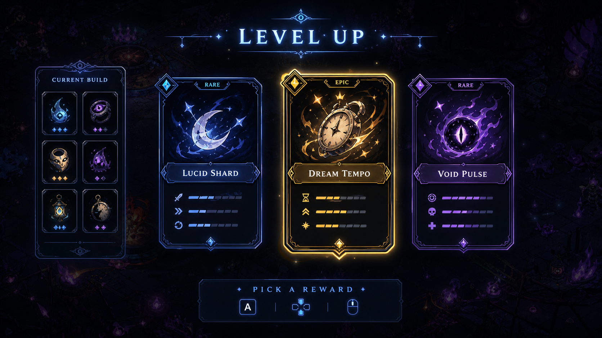
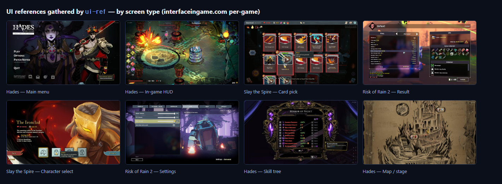
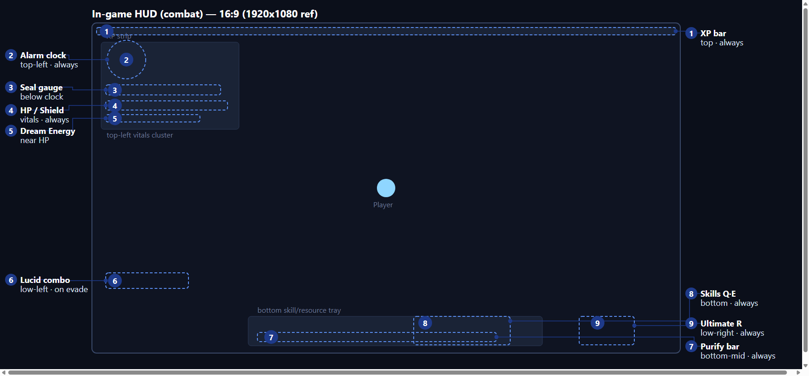
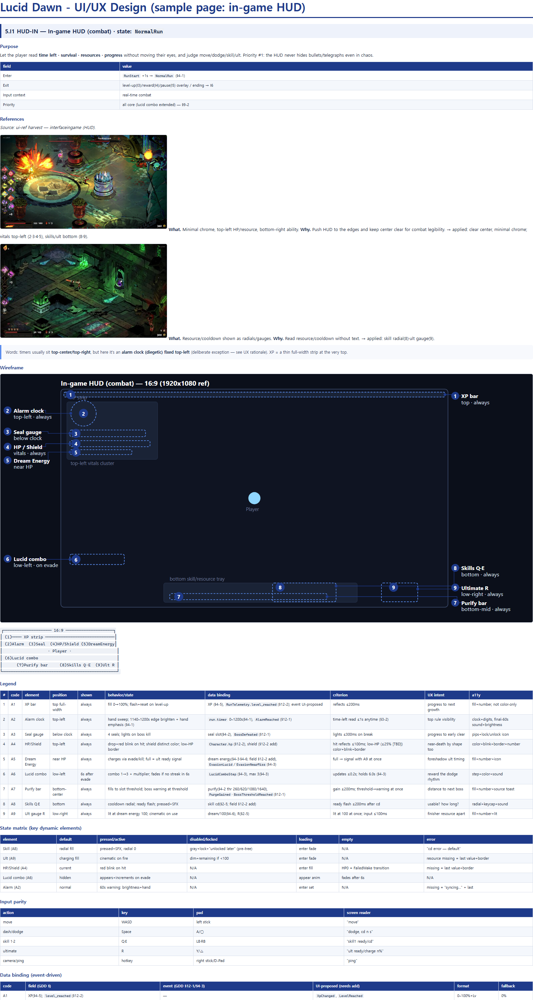
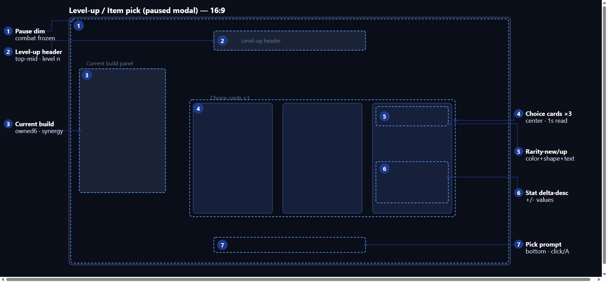
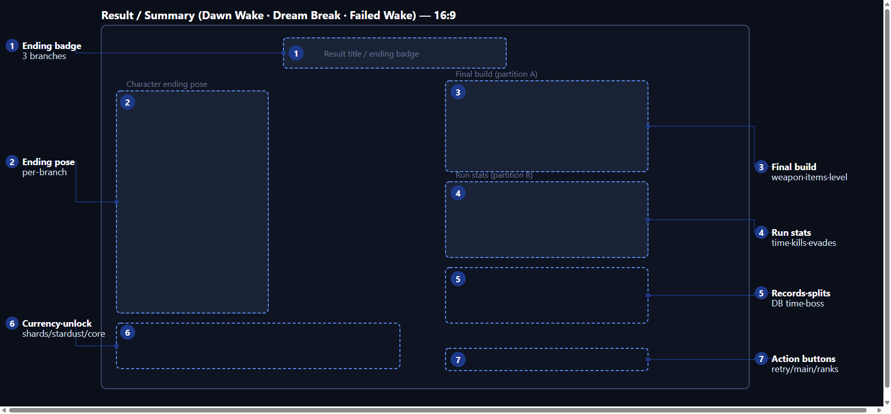
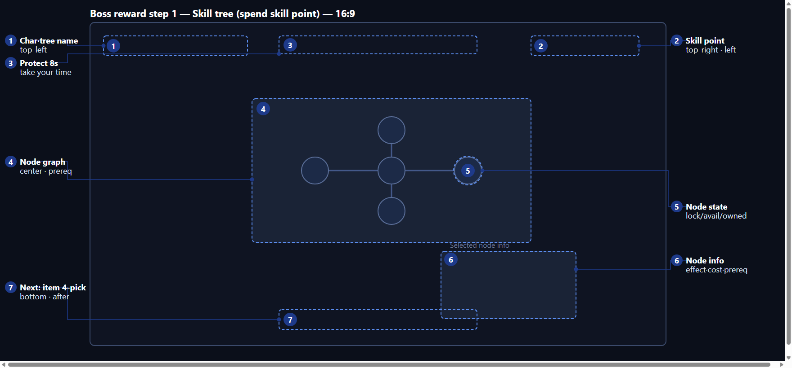
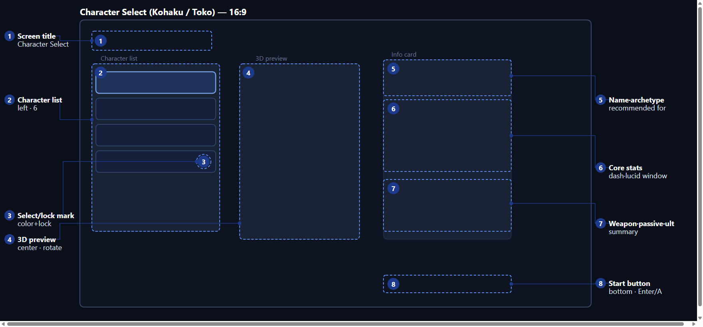

# Game-UI-Reference-Cli


**English** · [中文](README.zh.md) · [한국어](README.ko.md) · [日本語](README.ja.md)



**Concept art generated from UI references collected with this CLI.** The `game-ux-ui-design`
skill can take a stable wireframe, GDD/design context, and harvested reference notes, then ask
Codex/imagegen for UI art-direction mockups. This image is for mood/material direction; exact
text, measurements, states, and accessibility still come from the design document and tokens.

A small, dependency-light CLI for **UI reference research**, focused on game UI. It
indexes the UI reference images you already keep locally, and (optionally) collects
reference pages from public UI databases — rendering them, caching their HTML and
image metadata, and downloading thumbnails on request — so you can study UI/UX
patterns.

The primary, structured source is **[Game UI Database](https://www.gameuidatabase.com)
(gameuidatabase.com)**. Several other public UI/UX reference galleries also work via a
generic image-harvest mode (see [Supported sites](#supported-sites)).

It is deliberately conservative and polite:

- local references are indexed first;
- external URLs are fetched **only when you list them** (no crawling);
- assets are **not** downloaded unless you ask;
- a politeness delay, a per-run page cap, and a `robots.txt` check are built in.

> **Login-walled sites are out of scope.** Sites whose galleries require an account
> (e.g. Mobbin's app screens) cannot be collected by this tool and are intentionally
> not supported. This is a personal research helper — not a general-purpose scraper,
> and not for redistributing other people's assets. Respect each site's terms and
> `robots.txt`.

## What it finds — UI references

The core job is gathering real game-UI screenshots so you can study patterns. Point `ui-ref` at
reference pages and it renders them, caches metadata, and downloads thumbnails — which you curate
**by screen type**. Below are references it pulled for the sample, via
`ui-ref collect --browser --site interfaceingame` from per-game pages:



Every run also writes a browsable **contact sheet** (`ui_research/manifests/contact_sheet_*.html`)
where downloaded thumbnails render inline with each image's title, size, and **source link**, plus a
**manifest** (`scan-local` → `local_ui_refs_manifest.{json,md}`). These gathered references are what
the wireframes below are **derived from** — each design screen cites the exact shots it borrows from.

## Sample output

A full worked example lives in **[`examples/lucid-dawn/`](examples/lucid-dawn/)** — a complete UX/UI
design document for a survivor-like/roguelite (*Lucid Dawn: Dream Survivor*), generated by the `game-ux-ui-design`
skill from references harvested with `ui-ref`. It covers **12 screens** (out-game + in-game) with
**13 annotated wireframes**, and is available in English, Chinese, Korean, and Japanese.

**Annotated wireframe** — every UI element numbered, its region boxed/circled, a leader line pulled
*outside* the frame to a gutter label:



### How detailed is the design?

Under each wireframe, **every one of the 12 screens** gets all of this:

- **Purpose** (entry / exit / input context / priority)
- **References** — the real game UI it borrows from, embedded inline with "what / why" notes
- **Wireframe** (SVG) + **Legend** — per element: position · show-condition · behavior/state · **data binding** · a **measurable criterion** · plain-language UX intent · accessibility
- **State matrix** — default / hover / pressed / selected / disabled-locked / loading / empty / error
- **Input parity** — mouse · keyboard · gamepad · screen reader
- **Data binding** — every field/event **verified against the GDD**; anything not in the GDD is flagged as "needs GDD addition" (never silently invented)
- **Navigation · Edge cases · Accessibility · UX rationale (plain language) · Open questions · Acceptance checklist**

Plus companion docs: **design tokens** (color hex / type / motion / USS variables), a **decision &
number tracker** (every number tagged GDD-locked / standard / estimated), and appendices for
**engine binding (UI Toolkit × DOTS)** and a **usability-test plan**.

<details>
<summary><b>See an actual excerpt — the in-game HUD legend + state matrix</b></summary>

Legend (excerpt of 9 rows):

| # | code | element | position | data binding | criterion | accessibility |
| --- | --- | --- | --- | --- | --- | --- |
| 2 | A2 | Alarm clock | top-left | `run.timer` 0–1200s (§4-1), `AlarmReached` (§12-1) | read time-left ≤1s anytime | clock + digits; final-60s sound + brightness |
| 4 | A4 | HP / Shield | top-left | `Character.hp` (§12-2), shield (§12-2 add) | hit reflects ≤100ms; low-HP shown by color+blink+border | color + blink + border + number |
| 7 | A7 | Purify bar | bottom-center | purify (§4-2), `PurgeGained` · `BossThresholdReached` (§12-1) | gain reflects ≤200ms; threshold → boss warning | fill + number + source toast |

State matrix (excerpt):

| element | default | pressed/active | disabled/locked | error |
| --- | --- | --- | --- | --- |
| Skill (A8) | radial fill | pressed + SFX, radial 0 | gray + lock + "unlocked later" | "cd error — default" |
| Ult (A9) | charging fill | cinematic on fire | dim + remaining if <100 | last value + warning border |

</details>

Here's an **actual rendered page** of the design (the in-game HUD screen — reference shots, the
annotated wireframe, and the full 10-column legend table, exactly as delivered):



**More screens** — full set in [`examples/lucid-dawn/wireframes/`](examples/lucid-dawn/wireframes/):

 
 

Read the full design: [English](examples/lucid-dawn/lucid_dawn_ui_ux_design.en.md) ·
[Chinese](examples/lucid-dawn/lucid_dawn_ui_ux_design.zh.md) ·
[Korean](examples/lucid-dawn/lucid_dawn_ui_ux_design.ko.md) ·
[Japanese](examples/lucid-dawn/lucid_dawn_ui_ux_design.ja.md) ·
[PDF](examples/lucid-dawn/lucid_dawn_ui_ux_design.en.pdf).

## Install

```bash
git clone https://github.com/SillyToolValley/Game-UI-Reference-Cli
cd Game-UI-Reference-Cli
pip install -e .
```

Optional browser support (required for JavaScript-rendered sites — i.e. most of them):

```bash
pip install -e ".[browser]"
playwright install chromium     # one-time: downloads the headless browser
```

| | `scan-local` | `collect` (static) | `collect --browser` |
| --- | --- | --- | --- |
| Needs only Python stdlib | ✅ | ✅ | — |
| Needs `playwright` + a browser | — | — | ✅ |
| Works on server-rendered pages | n/a | ✅ | ✅ |
| Works on JS-rendered reference sites | n/a | ✗ (0 items) | ✅ |

The browser path uses **Playwright** directly (a realistic desktop UA + viewport, with
optional auto-scroll to load lazy images). No stealth/anti-bot layer is bundled — the
supported public sites serve their content to a normal headless browser; the built-in
politeness is what keeps runs well-behaved.

## Quick start

From your project root:

```bash
ui-ref init --project-name "My Project"
# put reference images under references/ui/<collection>/<category>/*.png|jpg|...
ui-ref scan-local
```

## Companion skill: `game-ux-ui-design`

This repo ships a **Claude Code skill** that turns the references you gather here into an
**exemplary game UX/UI design document** — purpose-built for survivor-like /
bullet-heaven / roguelite games. It lives in [`.claude/skills/game-ux-ui-design/`](.claude/skills/game-ux-ui-design/).

Given a GDD or feature brief, it produces a design document where:

- **reference images are embedded inline** in each screen (harvested with `ui-ref`);
- **wireframes are derived from those references**, with **every UI element numbered**, its
  region marked by a rectangle/circle, and a **leader line pulled outside the frame** to a
  description (SVG annotated-callout kit — see
  [`templates/wireframe-kit.svg`](.claude/skills/game-ux-ui-design/templates/wireframe-kit.svg));
- each screen carries a **legend table, state matrix, input-parity, and data-binding** tables;
- every screen gets a rigorous **UX rationale** section grounded in named game-UX heuristics
  (Hodent, Nielsen, Pinelle/PLAY, accessibility guidelines); and
- the markdown source renders to a **wide 16:9 landscape PDF** (`build_pdf.py` + `design-pdf.css`)
  so the dense design document tables stay readable for sharing.
- optionally, selected wireframes can be turned into **UI art concept mockups** with
  Codex/imagegen to test mood, material language, and card/HUD treatment before production art.

See **[`examples/lucid-dawn/`](examples/lucid-dawn/)** for a full generated sample (12 screens,
13 wireframes, tokens, decision tracker; English, Chinese, Korean, and Japanese) — and the
[Sample output](#sample-output) captures above.

To use it in your game project, copy the skill folder to that project's `.claude/skills/`
(or to `~/.claude/skills/` for all projects), then ask Claude Code to "draw up the UX/UI
design for &lt;screen&gt;".

## Commands

### `scan-local` — index local references

Walks `references/ui/<collection>/<category>/<file>`, reads image dimensions from the
file bytes (PNG/GIF/JPEG, no Pillow needed), infers coarse tags from the folder path,
and writes a JSON + Markdown manifest under `ui_research/manifests/`.

### `collect` — fetch explicitly listed pages

Put reference URLs (one per line) into `ui_research/urls.txt`, then:

```bash
# JS-rendered sites → use the browser. The right mode is auto-detected per URL's domain.
ui-ref collect --browser

# download a couple of images per page + scroll to load lazy ones
ui-ref collect --browser --scroll 6 --download-gallery-assets --download-asset-limit 2

# force a mode or a gallery class for an unknown site
ui-ref collect --browser --mode images
ui-ref collect --browser --gallery-class "thumb-card"
```

You can mix URLs from different supported sites in one `urls.txt` — each URL picks its
own preset automatically.

Each run writes, under `ui_research/manifests/`:

- `collected_pages_<run_id>.json` — per-page status, robots note, page title, and
  link/asset/gallery metadata;
- `contact_sheet_<run_id>.html` — a **browsable** sheet: downloaded thumbnails render
  inline, and every extracted/harvested image is listed with its title/size and a
  source link. Open it in a browser to review what you gathered.

Useful flags: `--site`, `--mode`, `--gallery-class`, `--scroll`, `--max-pages`,
`--delay`, `--timeout`, `--user-agent`, `--keep-*`, `--download-full-images`,
`--no-headless`.

## Supported sites

Two extraction modes:

- **`gallery`** — structured: reads gallery anchors (an anchor class plus
  `data-title` / `data-imageid` / `data-thumb`). Rich per-item metadata.
- **`images`** — generic: harvests the rendered page's ``/`srcset` images
  (obvious chrome like icons/avatars/logos is filtered out). Works on most sites.

The right mode/preset is auto-detected from each URL's domain; override with `--site`,
`--mode`, or `--gallery-class`.

| Site key | Domain | Mode | Notes |
| --- | --- | --- | --- |
| `gameuidatabase` | gameuidatabase.com | gallery | Game UI Database — structured gallery (use `--browser`). |
| `interfaceingame` | interfaceingame.com | images | Interface In Game — game UI screenshots. |
| `screenlane` | screenlane.com | images | Mobile UI/UX flows. |
| `collectui` | collectui.com | images | Daily UI inspiration. |
| `landbook` | land-book.com | images | Landing-page gallery. |
| `lapaninja` | lapa.ninja | images | Landing-page examples. |
| `refero` | refero.design | images | Web/iOS UI inspiration. |
| `dribbble` | dribbble.com | images | Design shots (public pages). |
| `behance` | behance.net | images | Creative showcase (public pages). |

Any **other** site without a preset defaults to `images` mode (generic harvest). A site
whose galleries require login is not supported.

### Adding a site

Add one entry to `SITE_PRESETS` in `ui_ref_cli.py` (and a row to the table above):

```python
SITE_PRESETS = {
    "gameuidatabase": {"match": "gameuidatabase.com", "mode": "gallery",
                       "gallery_class": "galleryimage", "notes": "..."},
    # generic image-harvest site:
    "mysite": {"match": "example.com", "mode": "images", "notes": "..."},
}
```

- `match` — a domain substring used to auto-select the preset from a URL.
- `mode` — `"gallery"` (needs `gallery_class`) or `"images"` (generic harvest).
- `gallery_class` — for gallery mode, the `<a>` class that marks a gallery image. If a
  site exposes gallery metadata under different attribute names than
  `data-title` / `data-imageid` / `data-thumb`, extend `LinkExtractor.handle_starttag`.

## Config discovery

Without `--config`, the CLI looks for `ui_ref_config.json` in:

```text
ui_ref_config.json
ui_research/ui_ref_config.json
docs/ui_research/ui_ref_config.json
```

Use `--project-root` to run against a project folder from elsewhere.

## Etiquette

Keep runs small and slow (the defaults are an 8s delay and 20 pages/run). Treat
collected pages as citation/reference context — not a redistributable asset pack, and
not training data.

## License

MIT — see [LICENSE](LICENSE).
