# Lucid Dawn: Dream Survivor — 전체 UI/UX 디자인 문서 (아웃게임 + 인게임)

> **주석형 와이어프레임 디자인 문서.** 각 화면은 ① 참고한 실제 게임 UI(`ui-ref`로 웹 수집, 인라인 임베드),
> ② 그로부터 파생한 와이어프레임(`wireframes/*.svg`), ③ 번호가 매겨진 범례(모든 요소를 박스/원으로 표시하고
> 리더선을 프레임 밖으로 빼서 설명에 연결), ④ 상태 매트릭스 · 입력 동등성 · 데이터 바인딩, ⑤ 쉬운 말로 쓴
> **UX 설계 의도**로 구성된다. 편집 원본 = 이 `.md`, 공유본 = 와이드 16:9 PDF/DOCX(부록 C). 동반 문서:
> **디자인 토큰** `lucid_dawn_ui_ux_tokens.md`, **결정/수치 추적기** `lucid_dawn_ui_ux_decisions.md`
> (EN/中文/한글 버전이 공유).

> **참고 출처.** 이미지는 **Game UI Reference CLI (`ui-ref`)** 로 **interfaceingame.com** 의 게임별 페이지에서
> 수집했다(Hades · Risk of Rain 2 · Honkai: Star Rail · Slay the Spire · Returnal · Hollow Knight ·
> Moonlighter · Destiny 2). 재배포 가능한 에셋 팩이 아니라 개인 리서치용 인용이다. 인덱스/레시피는 부록 B.
> 직접적인 survivor-like 패턴(Vampire Survivors/Brotato/20MTD)은 수집 사이트에 없으므로 §B-2 에서 글로 설명한다.

---

## 0. 표지

| field | value |
| --- | --- |
| Document | Lucid Dawn: Dream Survivor — 전체 UI/UX 디자인 문서 (아웃게임 + 인게임) |
| Game / build | Lucid Dawn: Dream Survivor / Vertical Slice (v0.8 범위, v0.9 GDD) |
| Version / date / author | v1.0 (한국어, EN 마스터 기반) / 2026-06-30 / UX |
| Status | draft |
| Source GDD | `GameDesign/lucid_dawn_design_docs/lucid_dawn_gdd.md` (§2 루프, §4 시스템, §5 캐릭터, §6 스테이지, §7 보스, §9 UI/UX, §10 BM/기록, §12 TDD 인계) |
| Wireframes | 아웃게임 `title-mainmenu/character-select/stage-select/settings/meta-progress/leaderboard.svg`; 인게임 `hud/hud-boss/levelup/skilltree/results/pause.svg`; `flow.svg` |

---

## 1. 개요 및 목표

- **이 문서가 해결하는 문제**: GDD §9-1(화면 흐름)과 §9-2(HUD 표)는 "무엇이 어디에 들어가는지"만 정한다. 실제로 만들려면 메뉴(아웃게임)부터 전투/보상/결과(인게임)까지 모든 화면의 상태, 입력, 데이터 바인딩, 엣지 케이스, 접근성, 그리고 *왜* 가 필요하다.
- **핵심 경험 (GDD §1-1)**: "압박 → 순간 판단 → 완벽 회피 → 루시드 러시 → 정화/성장 → 내 손으로 깨어나기". UI는 이 루프를 절대 가려서는 안 된다.
- **측정 가능한 성공 기준**
  - 아웃게임: 첫 플레이어가 **3분** 안에 런을 시작한다(메뉴 깊이 + 라벨 명료성).
  - 인게임: 어느 순간이든 **7:00까지 남은 시간**을 1초 안에 읽을 수 있다(§3-2). 적 180마리 하드캡(§6-4)에서도 플레이어, 치명적 탄, 위험 지대, 픽업이 **색 + 형태**로 구분된다(§13-3 #5).
  - 보상 흐름은 GDD §12-3을 따른다: **스킬 포인트 지급 → 스킬 트리 → 별도의 4종 아이템 선택**.
  - BM(§10): 유료 강화 없음, 가챠 없음 → 메타 화면은 **플레이 해금 전용(구매 UI 없음)**.
- **포함 범위**: 아웃게임 O1 타이틀/메인, O2 캐릭터 선택, O3 스테이지/난이도, O4 옵션, O5 메타 진행(해금/도감), O6 리더보드; 인게임 I1 HUD, I2 HUD(보스/히든), I3 레벨업/아이템 선택, I4 보스 보상(트리 + 4종 선택), I5 일시정지, I6 결과(3분기).
- **범위 밖 (이 문서)**: 코옵 전용 UI(로비/팀 게이지/유령/합동 궁극기 — GDD §8)는 VS에서 미구현 → §6-1에서 리스크로 추적. 튜토리얼 화면, 상점(BM상 없음), 컷씬 폴리시는 추후.

---

## 2. 사용자 및 맥락

- **페르소나**: survivor-like / 20분 생존 / 탄막 / 액션 로그라이트 / 코옵-PvE 플레이어(GDD §1). 초심자(첫 Dawn Wake)부터 베테랑(Dream Break / 무피해 기록)까지 공존.
- **플랫폼 / 입력**: PC/Steam 우선. 키보드+마우스와 게임패드 둘 다(GDD §2-5). 터치는 범위 밖(설계는 패드 동등 확장 가능하게 유지).
- **진입 맥락**: 아웃게임 = 비전투, 포커스 중심. 인게임 = 실시간 전투, 단 레벨업/보상은 일시정지/보호 하에 선택(§4-5, §7-1). 1런 = 6:40→7:00(20분, 내부 0–1200s). HUD는 런 중에만, 메뉴/결과에서는 숨김. VS 로스터 = Kohaku, Toko(나머지 4명 잠김), 스테이지 = LD-001(§3, §5, §6-2).

### 2-1. 설계 원칙 (모든 화면)
| # | 원칙 | 여기서의 의미 | 어기면 |
| --- | --- | --- | --- |
| P1 | 즉각 피드백 | 모든 행동/상태 변화가 즉시 응답한다(사운드 + 표시) | 손맛/인지 약함 |
| P2 | 위험 가독성 | 플레이어 > 즉각 위협(탄/구역/차징) > 픽업 > 배경 | 위험을 못 봄 |
| P3 | 혼돈 속 가독성 | 적 180마리에서도 핵심은 색+형태+사운드로 유지, 연출은 절제 | 일격 패턴이 묻힘 |
| P4 | 일관성 | 위치/색/아이콘/조작/바 형태를 화면 간 고정, 의도적 예외는 명시 | 끊임없는 혼란 |
| P5 | 점진적 공개 | 핵심부터, 나머지는 필요할 때(루시드/정화/보스는 첫 등장 때 안내) | 초심자 과부하 |
| P6 | 접근성 | 색만으로 전달 금지(색+형태+텍스트), 자막, 흔들림/플래시/컷인 토글, 리매핑 | 색약/민감 사용자 배제 |

---

## 3. 와이어플로우

```text
[Title/Main O1] --any key/single--> ┬ [Character O2] --confirm--> [Stage/Difficulty O3] --start--> (in-run)
                                     ├ [Options O4] · [Meta O5] · [Leaderboard O6] · Quit
(in-run, HUD shown)
[RunStart] --1s--> [NormalRun I1]
   [NormalRun] --level-up--> [Level-up I3] --confirm--> [NormalRun]   (paused)
   [NormalRun] --ESC--> [Pause I5] --resume--> [NormalRun]
   [NormalRun] --purify threshold--> [BossWarning] --appear--> [BossFight I2]
   [BossFight] --defeat--> [BossReward I4: tree→4-pick] --> [NormalRun]
   [4 seals broken] --> [HiddenBossAttempt I2]  (boss HP + time left)
(ending → result)
[HP0]→FailedWake ┐  [7:00]→DawnWake ├─> [Result I6]   [kill hidden boss before 7:00]→DreamBreak ┘
```

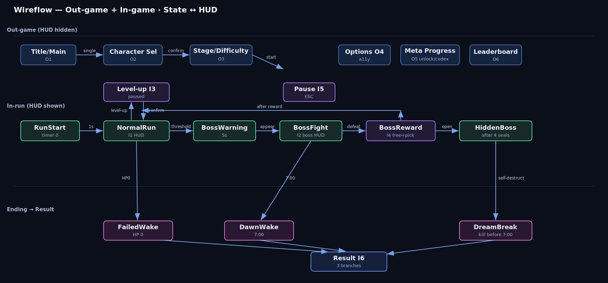

| 전이 | 트리거 (이벤트/조건) | 목적지 | 상태 ↔ HUD |
| --- | --- | --- | --- |
| Title → Main | 아무 키 | Main | HUD 숨김 |
| Main → Character → Stage → run | 싱글 → 확정 → 시작 | in-run | HUD 표시 |
| NormalRun → Level-up | `RunTelemetry.level_reached` ++ | I3 모달 | 전투 **일시정지** |
| NormalRun → Pause | ESC/Start | I5 | 전투 **일시정지** |
| NormalRun → BossWarning | `BossThresholdReached` (§12-1) | 경고 5s | HUD 유지 |
| BossWarning → BossFight | `BossSpawned` (§12-1) | I2 | 상단 중앙 보스 HP 점유 |
| BossFight → BossReward | `BossDefeated` (§12-1) | I4 | 보상 흐름, **8s 보호** |
| 4 seals → hidden boss | `HiddenBossSpawned` (§12-1) | I2 히든 | 보스 HP + 남은 시간 |
| in-run → result | `AlarmReached`/HP0/`DreamBreakAchieved` (§12-1) | I6 | HUD 숨김 |

### 3-1. 참고 개요
와이어프레임이 참고한 실제 게임 UI(웹 수집). **실제 이미지 + 노트는 각 화면의 `#### References`에 인라인 임베드된다.** 직접적인 survivor-like(Vampire Survivors/Brotato/20MTD)는 interfaceingame에 없으므로, 패턴은 로그라이트(Hades·Slay the Spire·Returnal·RoR2), 액션(Hollow Knight·Destiny 2), 애니풍(Honkai: Star Rail)에서 가져오고, 직접 장르 패턴은 글로 설명한다(§B-2).

## 4. 글로벌 컴포넌트 인벤토리

> **비주얼 토큰(컬러 hex / 타이포 / 간격 / 모션 / USS 매핑)은 [`lucid_dawn_ui_ux_tokens.md`](lucid_dawn_ui_ux_tokens.md) 에 있다.** 아래 "tokens" 열은 그 파일의 구체 값(`ld.color.*`)을 가리킨다. 수치 확정 상태: [`lucid_dawn_ui_ux_decisions.md`](lucid_dawn_ui_ux_decisions.md).

| code | 컴포넌트 | 변형 | tokens (색/형태/규칙) | 사용처 |
| --- | --- | --- | --- | --- |
| C-BAR | 수평 미터 | hp·shield·xp·purge·dream·boss | 수평 전용; 타입별 색+아이콘+위치; 위험 = 색+점멸+테두리 | I1·I2 |
| C-CARD | 선택 카드 | common·uncommon·rare·lucid | 희귀도 = 색+테두리+코너 아이콘; new/upgrade 텍스트 배지; 1초 가독 | I3·I4 |
| C-RADIAL | 쿨다운 라디얼 | skill Q·E·ult R | 라디얼 채움 + 키캡 글리프; 준비 완료 = 1회 플래시 + 사운드 | I1 |
| C-NODE | 스킬 노드 | locked·available·owned | lock=자물쇠+회색, available=포커스 테두리, owned=채움; 절대 색만으로 X | I4·O5 |
| C-LIST | 리스트/그리드 | menu·roster·stage·option·record | 항목 = 아이콘+라벨, 선택 = 테두리+체크, 잠금 = 자물쇠+조건 | O1·O2·O3·O4·O5·O6·I5 |
| C-PANEL | 정보 패널 | char·stage·node·item·option·record | 제목+요약+상세; 빈/오류 마이크로카피 | O2·O3·O4·O5·I4 |
| C-PROMPT | 입력 프롬프트 | mouse·key·pad | 현재 기기에 맞는 글리프 자동(암기 불필요) | 모든 화면 하단 |
| C-BADGE | 상태 배지 | rarity·ending·combo·new | 색 + **텍스트 라벨 필수** | I3·I4·I6 |

## 5. 화면 명세

> 화면별 순서: Purpose → References → Wireframe → Legend → State matrix → Input parity → Data binding → Navigation → Edge cases → Accessibility → UX rationale → Open questions → Acceptance. 아웃게임 O1–O6, 인게임 I1–I6.

---

### 5.O1 TITLE — 타이틀 / 메인 메뉴 · state: menu (HUD 숨김)

#### Purpose
첫인상이자 플레이 / 옵션 / 메타 / 리더보드로 가는 허브. "귀여운 악몽" 톤을 전하고, 첫 플레이어가 곧장 싱글플레이로 진입하게 한다.

| field | value |
| --- | --- |
| Enter | 실행 / Result "메인으로" |
| Exit | 싱글→O2 / 코옵(범위 밖) / O4·O5·O6 / 종료 |
| Input context | 비전투, 포커스 |
| Priority | core |

#### References — 이 화면이 참고한 실제 게임 UI
*출처: ui-ref 수집 — interfaceingame (메인 메뉴).*

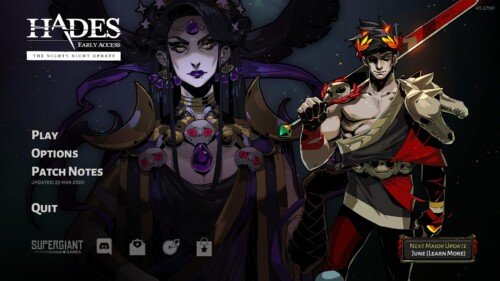
**What.** 좌상단 로고, 중앙-좌측 세로 메뉴(Play/Options/…), 우측 캐릭터 키 아트, 우상단 버전, 좌하단 플랫폼/소셜. **Why.** 시선이 "로고→메뉴"로 한 열에서 흐르고 아트가 톤을 판다. → 적용: 로고(1)·메뉴(2)·키 아트(4)·버전(5)·플랫폼/라이선스(6).

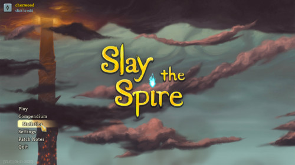
**What.** 큰 배경 위에 메뉴 항목 몇 개. **Why.** 항목을 최소화해 첫 진입 부담을 낮춘다. → 적용: 메뉴(2)를 짧게 유지.

> 글로: GDD §13-3 #1(라이선스/공식 혼동) → 메인 화면에 명시적 **플랫폼/라이선스 라인(6)** 을 확보.

#### Wireframe
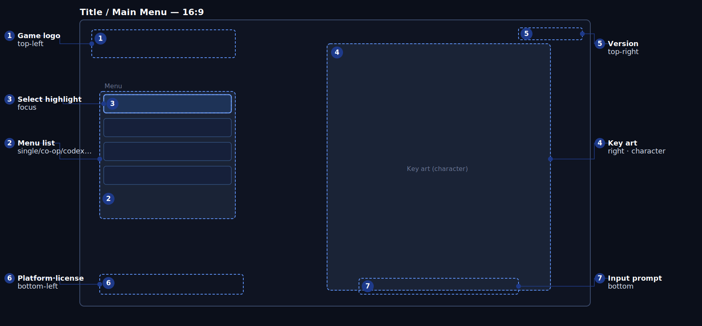

#### Legend
| # | code | 요소 | 위치 | 표시 | 동작/상태 | 데이터 바인딩 | 기준 | UX 의도 | a11y |
| --- | --- | --- | --- | --- | --- | --- | --- | --- | --- |
| 1 | T1 | 게임 로고 | 좌상단 | 항상 | 정적 / 작은 모션 | 정적 에셋 | 진입 시 표시 | 정체성/톤 | 로고+텍스트 이름 |
| 2 | T2 | 메뉴 리스트 | 중앙-좌측 | 항상 | 싱글/코옵/도감·해금/리더보드/옵션/종료; 코옵 잠김(VS) | 메뉴 정의(정적) | 선택 반응 ≤100ms | 핵심 경로를 한 열에 | 라벨 텍스트 + 포커스 |
| 3 | T3 | 선택 하이라이트 | 메뉴 항목 | 항상 | 포커스 강조 + SFX | 입력 포커스 | 이동 시 하이라이트 | 내가 어디 있나 | 테두리+색+사운드 |
| 4 | T4 | 키 아트 | 우측 | 항상 | 캐릭터 일러스트 | 정적 에셋 | — | 톤/캐릭터 | 장식(대체 텍스트) |
| 5 | T5 | 버전 | 우상단 | 항상 | 빌드/버전 | 빌드 메타 | — | 빌드 식별 | 텍스트 |
| 6 | T6 | 플랫폼·라이선스 | 좌하단 | 항상 | 플랫폼/소셜/라이선스 라인 | 정적 | — | 라이선스 혼동 방지(§13-3 #1) | 텍스트+아이콘 |
| 7 | T7 | 입력 프롬프트 | 하단 | 항상 | 현재 기기 프롬프트 | 입력 맵(§2-5) | 기기 변경 시 교체 | 어떻게 조작하나 | 기기 글리프+텍스트 |

#### State matrix (메뉴 항목 T2/T3)
| 요소 | default | hover/focus | pressed | disabled/locked | error |
| --- | --- | --- | --- | --- | --- |
| 메뉴 항목 (T2) | 일반 | 강조+SFX, 링 ≥3:1 | 눌림 | 코옵 = "Coming soon" (VS 잠금) | "메뉴 로드 오류 — 재시도" |
| 하이라이트 (T3) | 첫 항목 기본 포커스 | 추적 | — | 잠긴 항목 건너뜀 | — |

#### Input parity
| action | mouse | key | pad | screen reader |
| --- | --- | --- | --- | --- |
| 이동 | hover | ↑/↓ | D-Pad/스틱 | "Single Play, 1/6" |
| 실행 | 클릭 | Enter | A/○ | "Single Play 실행" |
| 종료 | 클릭 | — | — | "종료, 확인 필요" |

#### Data binding
| code | field (GDD §) | event (GDD §12-1) | UI-proposed (추가 필요) | format | fallback |
| --- | --- | --- | --- | --- | --- |
| T2 | menu/modes(정적), 코옵 잠금(§3 VS) | — | `MenuFocusChanged` | items | 기본 메뉴 |
| T5 | build meta(정적) | — | — | vX.Y | 빈값 |

#### Navigation
싱글→O2 / 옵션→O4 / 도감·해금→O5 / 리더보드→O6 / 코옵→(VS 잠금) / 종료→확인 모달. 기본 포커스 **Single Play**.

#### Edge cases
종료 = 되돌릴 수 없음 → 확인 모달. 세이브 없음(첫 실행): 메타/도감 비어 있으나 진입 가능. 코옵 잠김: "Coming soon", 시작 불가.

#### Accessibility
포커스 = 색+테두리+사운드; 잠금 = 자물쇠+텍스트. 자막/텍스트 크기. 라이선스 라인은 읽을 수 있는 대비(§13-3 #1).

#### UX rationale
- **한눈에 읽히게**: 로고→세로 메뉴가 한 줄로 흐르고, 항목이 6개뿐이라 첫 플레이어가 "Single Play"를 즉시 찾는다.
- **조작·실수 방지**: 기본 포커스가 싱글에; 종료는 확인; 코옵은 회색 "Coming soon"으로 헛클릭 방지.
- **재미·손맛**: 우측 키 아트가 첫 화면부터 "귀여운 악몽" 톤을 전한다.
- **첫 플레이 vs 반복**: 초심자는 싱글로, 베테랑은 메타/리더보드로 점프.
- **접근성**: 잠금/선택을 색만으로 표시하지 않음; 라이선스 라인 가독.
- **특히 조심할 점 (상위 3)**: ① 공식/라이선스 혼동(§13-3 #1) → 라이선스 라인 확보(법무 검토는 별도); ② 메뉴 과부하 → 항목 최소 + 기본 포커스; ③ 코옵 헛클릭 → 잠금 라벨.

#### Open questions
VS에서 코옵을 숨길지 회색 처리할지(현재 회색). 타이틀 모션/사운드 토글 위치.

#### Acceptance
- [ ] 첫 실행 시 기본 포커스가 Single Play.
- [ ] 코옵은 잠김으로 보이고 절대 시작되지 않음.
- [ ] 패드만으로 메뉴 이동 & 실행 가능.
- [ ] 라이선스 라인이 존재.

---

### 5.O2 CHARSEL — 캐릭터 선택 · state: menu

#### Purpose
각 캐릭터가 "꿈에서 깨어나는" 방식이 어떻게 다른지 보여주고(§5) 플레이어가 고르게 한다. VS: Kohaku/Toko 활성, 4명 잠김. 회피 손맛을 앞세운다.

| field | value |
| --- | --- |
| Enter | Main→싱글 / Result→Retry |
| Exit | 확정→O3 / 뒤로→Main |
| Input context | 비전투, 포커스 |
| Priority | core |

#### References
*출처: ui-ref 수집 — interfaceingame (캐릭터).*

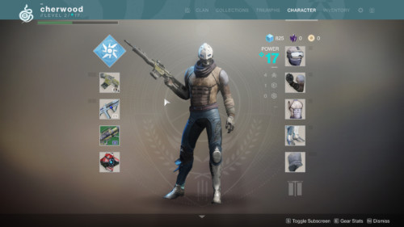
**What.** 희귀도 & 잠금 상태가 있는 초상 그리드/리스트, 포커스된 3D 캐릭터, 우측 정보 카드(이름/설명/스탯). **Why.** 그리드+잠금/희귀도가 보유 & 플레이스타일을 한눈에 보여주고, 좌/중/우 배치가 "둘러보기 + 비교"를 자연스럽게 한다. → 적용: 리스트(2)·잠금(3)·3D 프리뷰(4)·이름/아키타입(5)·핵심 스탯(6)·무기/패시브/궁극기(7).

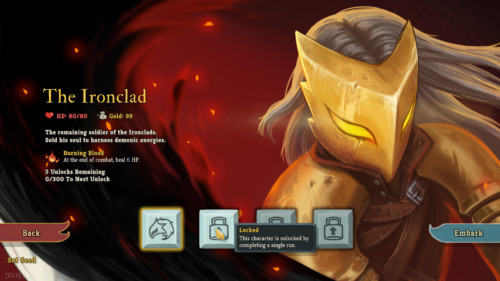
**What.** 캐릭터 몇 명을 큰 카드 + 한 줄 플레이스타일로. **Why.** 로스터가 작으면 큰 프리뷰 + 요약이 선택을 돕는다. → 적용: VS 2캐릭터 큰 프리뷰.

> 글로: 여기서의 핵심 차이는 **회피 손맛**이므로, 대시 거리/쿨다운/안전 시간/루시드 윈도우를 스탯 맨 앞에 둔다(§4-3).

#### Wireframe
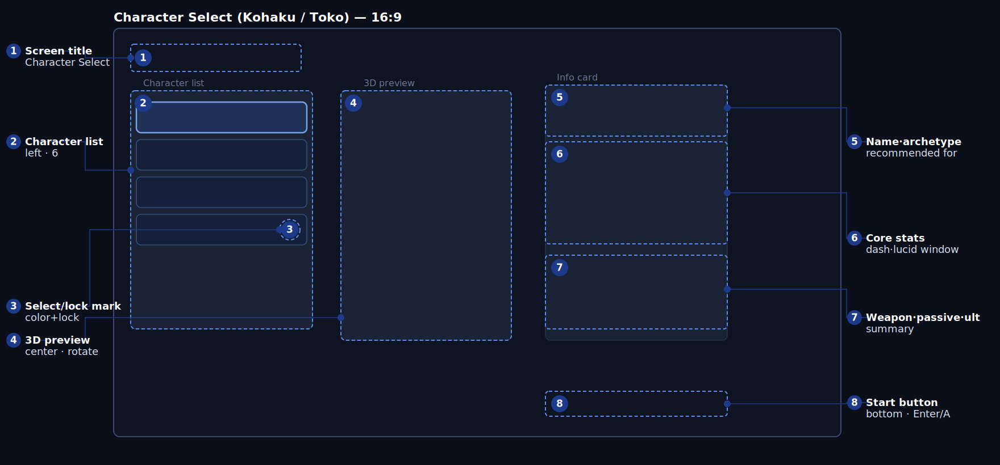

#### Legend
| # | code | 요소 | 위치 | 표시 | 동작/상태 | 데이터 바인딩 | 기준 | UX 의도 | a11y |
| --- | --- | --- | --- | --- | --- | --- | --- | --- | --- |
| 1 | E1 | 화면 제목 | 좌상단 | 항상 | "Character Select" | 정적 | 진입 시 표시 | 내가 어디 있나 | 텍스트 |
| 2 | E2 | 캐릭터 리스트 | 좌측 | 항상 | 6명; Kohaku/Toko 활성, 4명 잠김(§3,§5) | `Character.id`(§12-2), 로스터(§5) | 포커스가 우측을 즉시 동기화 | 선택지를 한 열에 | 아이콘+이름 |
| 3 | E3 | 선택/잠금 표시 | 리스트 항목 | 항상 | 선택=테두리, 잠금=자물쇠+회색+조건 | 해금(§2-3 메타) | 잠긴 항목 시작 불가 | 고를 수 있나 | 색+테두리+자물쇠 |
| 4 | E4 | 3D 프리뷰 | 중앙 | 항상 | 모델 회전/대기 | `Character.id`(§12-2) | 포커스 시 ≤200ms 교체 | 외형 보기 | 대체 텍스트(이름·플레이스타일) |
| 5 | E5 | 이름·아키타입 | 우상단 | 항상 | 이름+아키타입+추천(§5) | `Character`(§5) | 포커스 시 동기화 | 정체성 한 줄 | 텍스트 |
| 6 | E6 | 핵심 스탯 | 우측 중단 | 항상 | HP·이동·대시(거리/쿨/안전)·루시드 윈도우 | `Character.hp`·`move_speed`·`dash_*`·`lucid_window`(§12-2) | 캐릭터별 정확 값(§4-3,§5) | 회피 차이 | 바/레이더 + 숫자 |
| 7 | E7 | 무기·패시브·궁극기 | 우측 하단 | 항상 | 기본 무기·패시브·궁극기 모드 | `CombatWeapon`·`passive`·`ultimate_modifier`(§12-2) | 캐릭터별 정확(§4-4,§4-6,§5) | 어떻게 싸우나 | 아이콘+텍스트 |
| 8 | E8 | 시작 버튼 | 하단 | 활성 선택 시 | 확정 → O3 | 라우팅 | 잠긴 캐릭터면 비활성 | 다음 단계 | 버튼+프롬프트 |

#### Kohaku vs Toko (E6·E7 데이터, GDD §4-3/§5)
| 항목 | Kohaku (표준) | Toko (민첩) |
| --- | --- | --- |
| HP / 이동 | 110 / 6.0 | 90 / 6.8 |
| 대시 거리/쿨/안전 | 4.8m / 1.25s / 0.28s | 4.1m / 0.85s / 0.20s |
| 루시드 윈도우 | 0.10s | 0.08s |
| 기본 무기 | Star Pulse (단발) | Phantom Needle (3연발) |
| 패시브 | Steady Waking (회피 보상 +10%) | Fleeting Mischief (콤보 정화 +20%) |
| 궁극기 모드 | Cannon 폭 +10% | 캐논 후 대시 쿨 -35% |
| 추천 | 첫 플레이어, 안정 | 숙련 / 스피드런 |

#### State matrix (E2/E3, E8)
| 요소 | default | hover/focus | selected | disabled/locked | loading | error |
| --- | --- | --- | --- | --- | --- |
| 리스트 항목 (E2/E3) | 일반 | 강조+우측 동기화 | 테두리+체크 | 잠금=자물쇠+회색+"해금 조건"(§2-3) | 진입 페이드 | "캐릭터 로드 오류" |
| 시작 (E8) | 활성 | 강조+링 | — | 잠긴 선택이면 비활성+"잠긴 캐릭터" | — | "전환 실패 — 재시도" |
| 3D 프리뷰 (E4) | 대기 | — | — | — | "로딩…" (≠ 데이터 없음) | 모델 실패 = 초상 폴백 |

#### Input parity
| action | mouse | key | pad | screen reader |
| --- | --- | --- | --- | --- |
| 캐릭터 포커스 | hover | ↑/↓ | D-Pad/스틱 | "Kohaku, 표준, 해금됨" |
| 확정 | 클릭 | Enter | A/○ | "Kohaku 선택, 시작" |
| 뒤로 | 클릭 | Esc | B | "메인 메뉴" |

#### Data binding
| code | field (GDD §) | event | UI-proposed (추가 필요) | format | fallback |
| --- | --- | --- | --- | --- | --- |
| E2/E3 | `Character.id`(§12-2), 로스터(§5), 해금(§2-3) | — | `CharacterFocused`, `RosterLoaded` | list | 기본 2명 |
| E4 | `Character.id`(§12-2) | — | `PreviewLoaded` | 3D | 초상 |
| E6 | `Character.hp`·`move_speed`·`dash_*`·`lucid_window`(§12-2) | — | — | 숫자/레이더 | "—" |
| E7 | `CombatWeapon`·`passive`·`ultimate_modifier`(§12-2) | — | — | 요약 | "—" |

#### Navigation
확정(E8) → O3 → 런(I1). 뒤로 → Main. Result(I6) "Retry"가 여기로 진입.

#### Edge cases
잠긴 캐릭터: 포커스는 되나 E8 비활성 + 해금 조건. 기본 포커스 Kohaku(첫 플레이어 추천, §5). 프리뷰 실패 → 초상. 코옵(범위 밖): 플레이어별 선택 / 중복 허용(§8)은 VS 미구현.

#### Accessibility
잠금/선택은 색+테두리+자물쇠로; 스탯은 레이더와 함께 숫자 표시; 포커스 시 "이름·플레이스타일·해금" 안내; 3D 대체 텍스트.

#### UX rationale
- **한눈에 읽히게**: 좌측에서 고르면 → 중앙 외형 + 우측 성능이 즉시 갱신. 핵심 차이는 회피 손맛이므로 대시/루시드 윈도우를 스탯 맨 앞에 → Kohaku(안정) vs Toko(빠름/리스크)가 바로 읽힌다.
- **조작·실수 방지**: 잠김 = 자물쇠+조건+시작 비활성; 기본 포커스는 추천 입문자.
- **재미·손맛**: 3D 프리뷰 + 무기/패시브/궁극기 한 줄로 플레이스타일을 상상하게 한다.
- **첫 플레이 vs 반복**: 추천이 초심자를 안정형으로 안내, 베테랑은 스피드런 빌드용으로 Toko 선택.
- **접근성**: 색만으로 표시 X; 레이더 옆에 숫자.
- **특히 조심할 점**: ① 깜깜이 선택 → 회피 스탯 앞세움 + 한 줄 요약; ② 잠금 혼동(색약) → 자물쇠+텍스트; ③ 레이더 부정확 → 숫자; ④ 라이선스/공식 혼동(§13-3 #1) → 이름 표기 가이드라인(법무 별도).

#### Open questions
해금 조건 텍스트 노출. 스탯 레이더 vs 바(회피 4스탯은 바가 정확).

#### Acceptance
- [ ] Kohaku/Toko 활성, 4명 잠김, 구분 가능.
- [ ] 포커스 시 프리뷰 & 스탯 ≤200ms 동기화.
- [ ] 대시 거리/쿨/안전/루시드 윈도우를 GDD 값대로 표시.
- [ ] 색약 모드에서 잠금/선택 구분.
- [ ] 잠긴 캐릭터는 시작 비활성.

---

### 5.O3 STAGESEL — 스테이지 / 난이도 선택 · state: menu

#### Purpose
스테이지(VS: LD-001 Sleeping Room)와 난이도(Sleepy–Lucid)를 고르고, 각 선택이 무엇을 바꾸는지(적/보스/보상/정화 요구치) 보여준다.

| field | value |
| --- | --- |
| Enter | O2 확정 후 |
| Exit | 시작→런(I1) / 뒤로→O2 |
| Input context | 비전투, 포커스 |
| Priority | core |

#### References
*출처: ui-ref 수집 — interfaceingame (맵/레벨).*

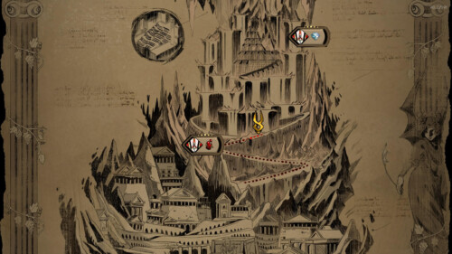
**What.** 진행 노드/경로 + 노드별 보상 프리뷰. **Why.** 고르기 전에 앞으로 올 것(적/보상)을 보여준다. → 적용: 스테이지 리스트(2)·정보(4).

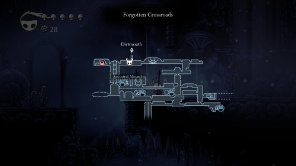
**What.** 맵상 현재 vs 잠긴 지역. **Why.** 해금 상태를 공간적으로 전달. → 적용: 잠금/선택 표시(3).

> 글로: 난이도(5)는 HP만이 아니라 정화 요구치 · 위협 · 보상 배율도 바꾼다(§2-4) → 정보 패널이 난이도에 따라 갱신.

#### Wireframe
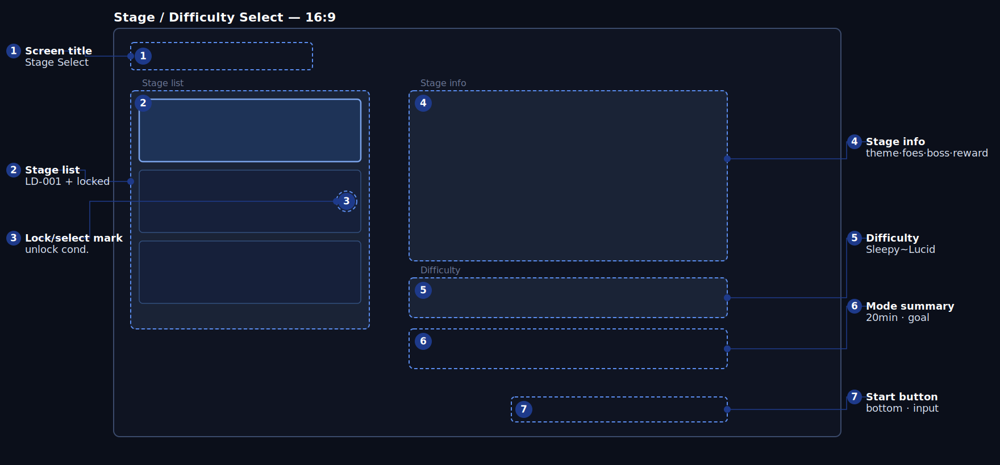

#### Legend
| # | code | 요소 | 위치 | 표시 | 동작/상태 | 데이터 바인딩 | 기준 | UX 의도 | a11y |
| --- | --- | --- | --- | --- | --- | --- | --- | --- | --- |
| 1 | G1 | 화면 제목 | 좌상단 | 항상 | "Stage Select" | 정적 | 즉시 | 어디인가 | 텍스트 |
| 2 | G2 | 스테이지 리스트 | 좌측 | 항상 | LD-001 활성 + 4개 잠김(§6-1) | 스테이지 정의(§6-1), 해금 | 포커스가 우측 동기화 | 어디서 싸우나 | 썸네일+이름 |
| 3 | G3 | 잠금/선택 표시 | 항목 | 항상 | 선택=테두리, 잠금=자물쇠+조건 | 해금 조건(§6-1) | 잠긴 항목 시작 불가 | 갈 수 있나 | 색+자물쇠+텍스트 |
| 4 | G4 | 스테이지 정보 | 우상단 | 항상 | 테마·적·보스·보상(§6-2) | 스테이지(§6-2), 난이도 배율(§2-4) | 포커스/난이도 시 갱신 | 무엇이 나오나 | 텍스트+아이콘 |
| 5 | G5 | 난이도 | 우측 중단 | 항상 | Sleepy/Normal/Nightmare/Lucid + 배율 | 난이도 배율(§2-4) | G5 변경이 G4 갱신 | 도전 선택 | 세그먼트+숫자+색 |
| 6 | G6 | 모드 요약 | 우측 | 항상 | Core Dream Run·20분·목표(생존/Dream Break) | 모드(§2-4) | — | 내가 할 일 | 텍스트 |
| 7 | G7 | 시작 버튼 | 하단 | 활성 선택 시 | 확정 → 런 | 라우팅 | 잠겼으면 비활성 | 시작 | 버튼+프롬프트 |

#### 난이도 데이터 (§2-4)
| 난이도 | 정화 요구 | 적 HP | 적 위협 | 보상 |
| --- | ---: | ---: | ---: | ---: |
| Sleepy | 0.85x | 0.85x | 0.80x | 0.90x |
| Normal | 1.00x | 1.00x | 1.00x | 1.00x |
| Nightmare | 1.18x | 1.20x | 1.25x | 1.15x |
| Lucid | 1.35x | 1.35x | 1.45x | 1.30x |

#### State matrix (G3, G5, G7)
| 요소 | default | hover/focus | selected | disabled/locked | error |
| --- | --- | --- | --- | --- | --- |
| 스테이지 (G3) | 일반 | 강조+동기화 | 테두리 | 잠금=자물쇠+"해금 조건"(§6-1) | "스테이지 로드 오류" |
| 난이도 (G5) | Normal 기본 | 강조 | 선택+배율 | Lucid 등은 메타 잠금 가능 | — |
| 시작 (G7) | 활성 | 강조+링 | — | 잠긴 스테이지면 비활성 | "전환 실패" |

#### Input parity
| action | mouse | key | pad | screen reader |
| --- | --- | --- | --- | --- |
| 스테이지 포커스 | hover | 방향키 | D-Pad | "Sleeping Room, 해금됨" |
| 난이도 변경 | 클릭 | ←/→ | LB/RB | "Normal, 보상 1.0x" |
| 시작 | 클릭 | Enter | A/○ | "Sleeping Room, Normal 시작" |
| 뒤로 | 클릭 | Esc | B | "캐릭터 선택" |

#### Data binding
| code | field (GDD §) | event | UI-proposed (추가 필요) | format | fallback |
| --- | --- | --- | --- | --- | --- |
| G2/G3 | 스테이지(§6-1), 해금 | — | `StageFocused`, `StagesLoaded` | list | LD-001 |
| G4 | 스테이지(§6-2), 난이도 배율(§2-4) | — | `StageInfoUpdated` | text/icon | 기본 |
| G5 | 난이도 배율(§2-4) | — | `DifficultyChanged` | 배율 | Normal |

#### Navigation
시작(G7) → 런(I1, RunStart). 뒤로 → O2. LD-001 외 스테이지는 §6-1 해금 충족 시에만 활성.

#### Edge cases
VS는 LD-001만 플레이, 나머지 잠금 프리뷰. Lucid 난이도는 메타 잠금 가능(자물쇠+조건). 난이도 변경 시 정보 숫자가 즉시 갱신되어야 함(잘못된 기대 방지).

#### Accessibility
난이도 차이는 배율 숫자 + 바로, 색만으로 X; 잠금 = 자물쇠+조건; 정보 텍스트 확대 가능.

#### UX rationale
- **한눈에 읽히게**: 좌측에서 스테이지 고르면 → 우측에 테마/적/보스/보상; 난이도를 바꾸면 그 숫자가 갱신되어 "무엇이 더 어려워지는지" 보인다.
- **조작·실수 방지**: 잠긴 스테이지/난이도 = 자물쇠+조건 + 시작 비활성.
- **재미·손맛**: 잠긴 스테이지도 "다음 목표"로 프리뷰.
- **첫 플레이 vs 반복**: 초심자는 Normal·LD-001 기본, 베테랑은 보상을 위해 Nightmare/Lucid 도전.
- **접근성**: 난이도를 숫자로도 전달.
- **특히 조심할 점**: ① 난이도가 뭘 바꾸는지 모름 → 정보에 배율(§2-4); ② 잠금 혼동 → 자물쇠+조건; ③ 후반 지루함(§13-3 #3) → 모드 요약에 Dream Break 목표를 명시해 동기 부여.

#### Open questions
난이도 잠금 조건(메타). 스테이지 리스트 맵 vs 카드(VS = 1 스테이지 → 카드로 충분).

#### Acceptance
- [ ] LD-001 활성, 나머지 잠금 프리뷰.
- [ ] 난이도 변경이 정보 배율을 즉시 갱신.
- [ ] 색약 모드에서 난이도/잠금 구분.
- [ ] 패드만으로 스테이지/난이도 선택 & 시작.

---

### 5.O4 SETTINGS — 옵션 / 설정 · state: menu (또는 Pause에서)

#### Purpose
게임플레이/디스플레이/오디오/UI-접근성/조작 옵션(GDD §9-3 접근성 포함)을 묶고 각 항목이 무엇을 바꾸는지 설명한다. **접근성은 일급 시민이다.**

| field | value |
| --- | --- |
| Enter | Main(O1) / Pause(I5) |
| Exit | 뒤로 → 호출자 |
| Input context | 비전투, 포커스 |
| Priority | core (접근성) |

#### References
*출처: ui-ref 수집 — interfaceingame (설정).*

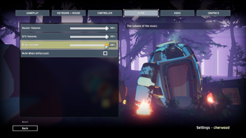
**What.** 상단 탭(Gameplay/Keyboard/Controller/Audio/Video/Graphics), 좌측 슬라이더/토글, 우측 설명, 하단 Back/Revert. **Why.** 탭 + 좌측 컨트롤 + 우측 설명은 학습 부담이 낮은 표준. → 적용: 탭(1)·옵션(2·3)·설명(4)·하단(6).

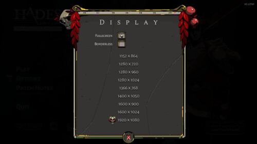
**What.** 항목별 현재 값 + 좌/우 조정. **Why.** 슬라이더/스테퍼가 값 변경을 명확히. → 적용: 옵션 컨트롤(3).

> 글로: 전용 **접근성 그룹(5)** 을 강조 — 색약 팔레트 · 화면 흔들림 · 플래시 · 후처리 · 히트 판정 표시 · 컷인 간소화 · 오토에임 보정 · 루시드 회피 보조 · 자막(§9-3).

#### Wireframe
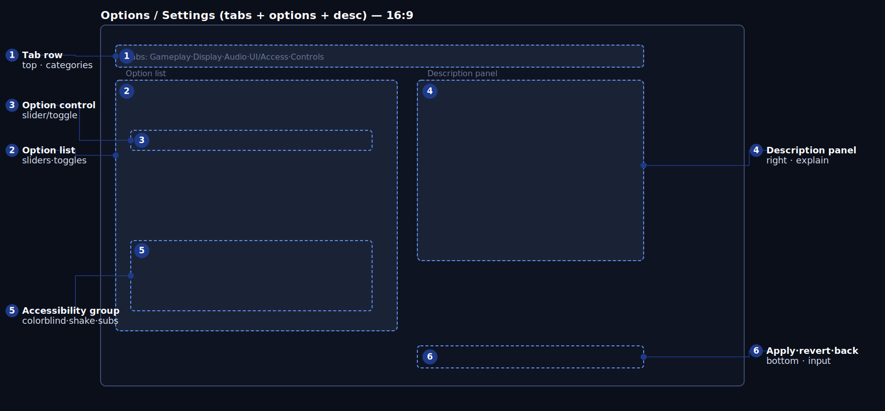

#### Legend
| # | code | 요소 | 위치 | 표시 | 동작/상태 | 데이터 바인딩 | 기준 | UX 의도 | a11y |
| --- | --- | --- | --- | --- | --- | --- | --- | --- | --- |
| 1 | S1 | 탭 행 | 상단 | 항상 | Gameplay·Display·Audio·UI/Access·Controls | 카테고리(정적) | 탭이 옵션을 즉시 교체 | 찾을 그룹 | 탭 라벨 + 선택 |
| 2 | S2 | 옵션 리스트 | 좌측 | 항상 | 탭별 슬라이더/토글/스테퍼 | 설정(저장됨) | 변경 반영/프리뷰 | 한곳에 모음 | 라벨+값 텍스트 |
| 3 | S3 | 옵션 컨트롤 | 행 | 항상 | 슬라이더/토글; 현재 값 | 설정(저장됨) | 조정 ≤100ms 반영 | 값 변경 명확 | 값 텍스트+단계 |
| 4 | S4 | 설명 패널 | 우측 | 옵션 포커스 시 | 포커스된 옵션의 효과 | 옵션 메타(정적) | 포커스 시 설명 갱신 | 무엇을 바꾸나 | 텍스트 |
| 5 | S5 | 접근성 그룹 | 좌측(섹션) | UI/Access 탭 | 색약·흔들림·플래시·컷인·자막·에임·보조(§9-3) | a11y 설정(저장됨) | 토글 즉시 적용 | 접근성을 전면에 | 토글+상태 텍스트 |
| 6 | S6 | 적용·되돌리기·뒤로 | 하단 | 항상 | 적용/취소/나가기 | — | 적용 시 저장 확정 | 안전한 변경 | 버튼+프롬프트 |

#### State matrix (S3)
| 요소 | default | hover/focus | active | disabled | error |
| --- | --- | --- | --- | --- | --- |
| 옵션 컨트롤 (S3) | 현재 값 | 강조+설명 | 드래그/토글 중 | 종속 항목 비활성+사유("전체화면 전용") | "설정 저장 실패 — 재시도" |
| 탭 (S1) | 첫 탭 | 강조 | 눌림 | — | — |

#### Input parity
| action | mouse | key | pad | screen reader |
| --- | --- | --- | --- | --- |
| 탭 전환 | 클릭 | Q/E·Tab | LB/RB | "Audio 탭" |
| 옵션 포커스 | hover | ↑/↓ | D-Pad | "음악 볼륨, 80%" |
| 값 조정 | 드래그/클릭 | ←/→ | 스틱/D-Pad | "음악 볼륨 75%" |
| 적용/뒤로 | 클릭 | Enter/Esc | A/B | "적용됨" |

#### Data binding
| code | field (GDD §) | event | UI-proposed (추가 필요) | format | fallback |
| --- | --- | --- | --- | --- | --- |
| S2/S3 | 설정(저장됨; §9-3 a11y 항목) | — | `SettingChanged`, `SettingsLoaded` | value | 기본 |
| S5 | a11y 설정(§9-3) | — | `AccessibilityChanged` | toggle/value | 기본 off/standard |
| S6 | — | — | `SettingsApplied`, `SettingsReverted` | — | — |

#### Navigation
뒤로 → 호출자(Main 또는 Pause). Pause에서 진입했으면 전투는 계속 일시정지.

#### Edge cases
종속 옵션(전체화면↔해상도)은 비활성+사유. 뒤로 시 미적용 변경: "저장 안 됨 — 적용/취소". 리매핑 충돌: 동일 키 경고 + 해결.

#### Accessibility
이 화면이 모든 것의 관문: 색약 팔레트, 흔들림/플래시/후처리/컷인 토글, 히트 판정 표시, 오토에임 보정, 루시드 회피 보조, 자막(크기/배경/속도) — 전부 §9-3. 토글 상태 = 색 + 텍스트(ON/OFF).

#### UX rationale
- **한눈에 읽히게**: 탭이 옵션을 묶고, 우측의 포커스된 옵션 설명이 "이게 뭘 하지?"에 답한다.
- **조작·실수 방지**: 적용/되돌리기로 변경을 안전하게; 종속 옵션은 사유와 함께 비활성; 리매핑 충돌은 경고.
- **재미·손맛**: 화려함보다 명료함; 볼륨/흔들림 즉시 프리뷰.
- **첫 플레이 vs 반복**: 필요한 사람을 위한 접근성/조작을 앞에, 베테랑은 그래픽/게임플레이로.
- **접근성**: 이 화면이 §9-3 전부를 노출; 토글 = 색+텍스트.
- **특히 조심할 점**: ① 색약/민감 사용자 배제(§13-3 #5) → 색약/흔들림/플래시/컷인 토글을 일급으로; ② 변경 유실 → 미저장 확인; ③ 키 충돌 → 경고+해결.

#### Open questions
접근성 프리셋(색약/저자극 묶음). 어떤 옵션이 인게임에 실시간 적용되는가(흔들림 등).

#### Acceptance
- [ ] §9-3 접근성 항목 전부 노출; 토글은 색+텍스트로 표시.
- [ ] 옵션 포커스 시 설명 갱신.
- [ ] 미저장 변경 상태로 뒤로 가면 확인 모달.
- [ ] 패드만으로 탭/값/적용 동작.

---

### 5.O5 META — 메타 진행 (영구 해금 / 도감) · state: menu

#### Purpose
런 사이에 화폐(dream shards/stardust/lucid core, §2-3)를 써서 **플레이로만 해금**(캐릭터/스킬 트리/궁극기/유물/난이도)하고 도감을 본다. **GDD §10 BM: 유료 강화 없음, 가챠 없음 → 구매 UI 없음.**

| field | value |
| --- | --- |
| Enter | Main(O1) "도감/해금" |
| Exit | 뒤로 → Main |
| Input context | 비전투, 포커스 |
| Priority | core (반복 동기) |

#### References
*출처: ui-ref 수집 — interfaceingame (스킬 트리 / 컬렉션).*

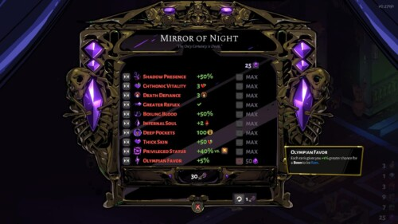
**What.** 강화 행(이름+효과+레벨 핍+MAX), 우상단 화폐, 우하단 선택 항목 설명. **Why.** 행+화폐+설명이 "무엇에 얼마"를 명확히. → 적용: 해금 리스트(3)·항목(4)·화폐(2)·설명(5)·해금 버튼(6).

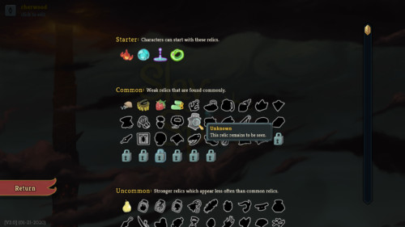
**What.** 수집한 아이템/카드 그리드. **Why.** 도감 수집 진행도. → 적용: 도감 탭(C-LIST).

> 글로: **현금 구매 버튼/가격 없음** — 모든 해금은 플레이로 번 화폐만 사용(§10). 이것이 일반 상점 화면과의 의도적 차이.

#### Wireframe
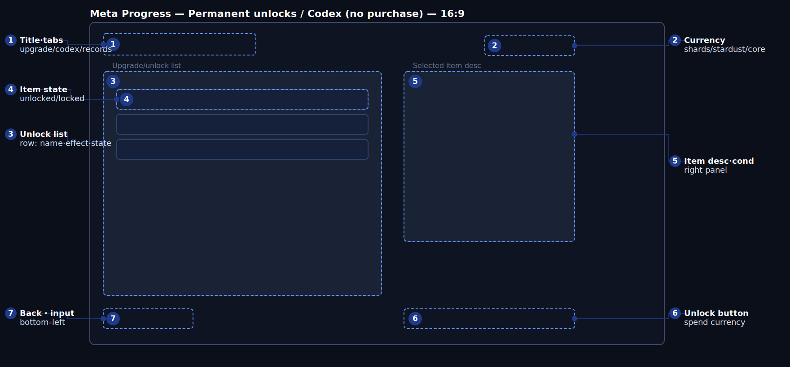

#### Legend
| # | code | 요소 | 위치 | 표시 | 동작/상태 | 데이터 바인딩 | 기준 | UX 의도 | a11y |
| --- | --- | --- | --- | --- | --- | --- | --- | --- | --- |
| 1 | K1 | 제목·탭 | 좌상단 | 항상 | 영구 강화 / 도감 / 기록 | 카테고리(정적) | 탭 즉시 전환 | 그룹화 | 탭 라벨 |
| 2 | K2 | 화폐 | 우상단 | 항상 | dream shards·stardust·lucid core(§2-3) | 메타 화폐(§2-3) | 변경 시 반영 | 무엇을 쓸 수 있나 | 아이콘+숫자 |
| 3 | K3 | 해금 리스트 | 중앙 | 강화 탭 | 행: 이름·효과·상태(보유/잠금) | 해금 항목(§2-3), `Item`/`SkillNode`(§12-2) | 포커스가 설명 동기화 | 무엇을 열 수 있나 | 행 라벨+상태 |
| 4 | K4 | 항목 상태 | 행 | 항상 | locked / available / owned | 비용·선행(§2-3) | 화폐 충족 시 "available" | 지금 열 수 있나 | 자물쇠/체크+색 |
| 5 | K5 | 항목 설명·조건 | 우측 | 포커스 시 | 효과·비용·해금 조건 | 항목 메타 | 포커스 시 갱신 | 해금 전 확인 | 텍스트 |
| 6 | K6 | 해금 버튼 | 우측 하단 | available | 화폐 소모로 해금(현금 X) | 비용(§2-3) | 클릭 시 차감+확인 | 해금 확인 | 버튼+프롬프트 |
| 7 | K7 | 뒤로·입력 | 좌하단 | 항상 | 나가기 | — | — | 떠나기 | 버튼 |

#### State matrix (K4, K6)
| 요소 | default | hover/focus | selected | disabled/locked | error |
| --- | --- | --- | --- | --- | --- |
| 항목 (K4) | 보유=체크 / 미보유=외곽선 | 강조+설명 | 방금 해금 표시 | 선행 미충족=자물쇠+조건 / 화폐 부족="N 부족" | "로드 오류 — 재시도" |
| 해금 (K6) | available 시 활성 | 강조+링 | — | 부족/미충족 시 비활성+사유 | "해금 실패 — 재시도" |

#### Input parity
| action | mouse | key | pad | screen reader |
| --- | --- | --- | --- | --- |
| 탭 전환 | 클릭 | Q/E | LB/RB | "도감 탭" |
| 항목 포커스 | hover | 방향키 | D-Pad/스틱 | "Lucid Sense, 비용 50 shards, 잠금: 보스 1회 처치" |
| 해금 | 클릭 | Enter | A/○ | "해금됨, 50 shards 소모" |
| 뒤로 | 클릭 | Esc | B | "메인" |

#### Data binding
| code | field (GDD §) | event | UI-proposed (추가 필요) | format | fallback |
| --- | --- | --- | --- | --- | --- |
| K2 | 메타 화폐(§2-3) | — | `CurrencyChanged` | number | 0 |
| K3/K4 | 해금 항목(§2-3), `SkillNode`/`Item`(§12-2) | — | `UnlockablesLoaded`, `UnlockStateChanged` | list | locked |
| K5 | 항목 메타·비용(§2-3) | — | `UnlockableFocused` | text | "선택" |
| K6 | 비용(§2-3) | — | `UnlockPurchased` (currency) | — | — |

> 현금 결제 이벤트는 정의되지 않음(§10 BM).

#### Navigation
뒤로 → Main(O1). 해금된 캐릭터/난이도는 O2/O3에서 즉시 활성. 도감 탭은 적/보스/아이템 컬렉션을 보여줌(§6-3, §4-5, §10).

#### Edge cases
화폐 부족: 버튼 비활성+금액. 선행 미충족: 자물쇠+조건("보스 1회 처치"). 해금 확인(화폐 소모는 되돌릴 수 없음). 빈 도감 항목: "미발견"(스포일러 최소화).

#### Accessibility
해금 상태(locked/available/owned)는 색+자물쇠/체크로; 화폐/비용 숫자 명시; 설명 확대 가능; 시간 압박 없음.

#### UX rationale
- **한눈에 읽히게**: 중앙 해금 리스트, 우측에 포커스 항목의 효과/비용/조건; 우상단 화폐가 "무엇을 얼마에 열 수 있나"를 알려준다.
- **조작·실수 방지**: 화폐 부족이나 선행 미충족은 사유와 함께 비활성; 해금은 확인.
- **재미·손맛**: 해금하면 항목이 채워지고 도감이 자란다 — 장기 반복 동기.
- **첫 플레이 vs 반복**: 초심자에게 다음 해금 1–2개 강조, 베테랑은 트리 최적화.
- **접근성**: 상태를 색만으로 X.
- **특히 조심할 점**: ① **수익화 혼동(§10 BM)** → 현금 UI 절대 없음, 화폐 해금만; ② 후반 지루함(§13-3 #3) → 도감/해금을 장기 목표로; ③ 색약 잠금 혼동 → 자물쇠+조건.

#### Open questions
도감 스포일러 정책(실루엣 vs 숨김). 영구 트리와 런 내 트리(I4)의 시각적 구분.

#### Acceptance
- [ ] 현금 구매 UI 없음; 모든 해금은 화폐 소모.
- [ ] 부족/미충족 항목은 비활성+사유 표시.
- [ ] 해금 시 화폐 차감 및 O2/O3에 반영.
- [ ] 색약 모드에서 잠금/보유 구분.

---

### 5.O6 LEADER — 리더보드 / 기록 · state: menu

#### Purpose
GDD §10 기록(Dream Break Time, 보스 구간 기록, 히든 보스 해금 시간, 무피해, 최고 정화, 코옵, 캐릭터 클리어)을 스테이지/난이도/캐릭터/솔로·코옵/조건별로 나눠 보여주고, **내 순위**를 강조해 경쟁을 유도한다.

| field | value |
| --- | --- |
| Enter | Main(O1) "리더보드" |
| Exit | 뒤로 → Main |
| Input context | 비전투, 포커스, 네트워크 의존 |
| Priority | extended (경쟁) |

#### References
*출처: 수집 게임에 직접적인 리더보드 캡처 없음; 순위 표 구성은 결과 통계 패널에서 파생.*

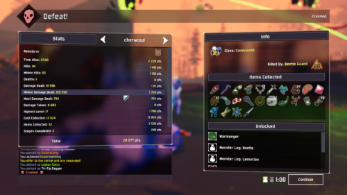
**What.** 좌측 통계 패널에 항목별 숫자가 줄 맞춰 나열. **Why.** 줄 맞춘 표가 많은 숫자를 가장 빠르게 비교. → 적용: 순위 표(4)·내 순위 강조(5) 행 구조.

> 글로: 실제 리더보드 캡처는 추후 Game UI Database `Leaderboards & Ranking`(scrn=55)에서 추가 가능 — 부록 B 참고(GUIDB 헤드리스 제한 유의). 필터(2)·기록 유형(3)·내 순위(5)는 일반 리더보드 패턴에서 글로 파생.

#### Wireframe
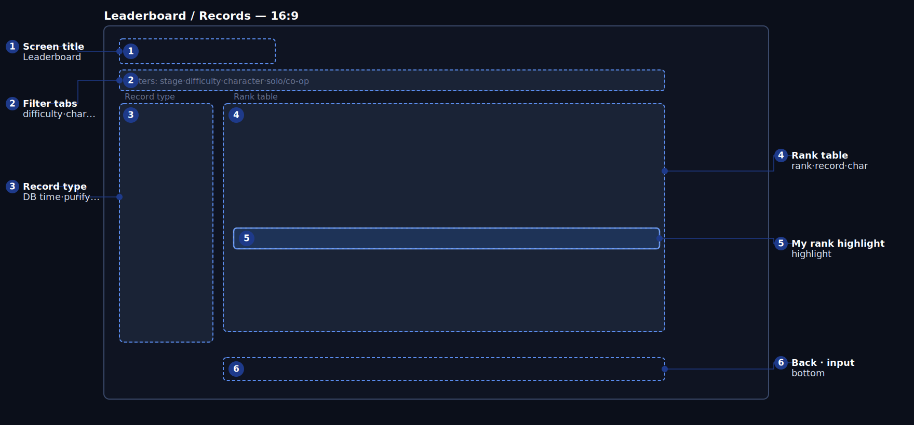

#### Legend
| # | code | 요소 | 위치 | 표시 | 동작/상태 | 데이터 바인딩 | 기준 | UX 의도 | a11y |
| --- | --- | --- | --- | --- | --- | --- | --- | --- | --- |
| 1 | L1 | 화면 제목 | 좌상단 | 항상 | "Leaderboard" | 정적 | 즉시 | 어디인가 | 텍스트 |
| 2 | L2 | 필터 탭 | 상단 | 항상 | 스테이지·난이도·캐릭터·솔로/코옵·조건(§10) | 필터(§10 축) | 변경 시 표 갱신 | 동일 조건 비교 | 탭 라벨+선택 |
| 3 | L3 | 기록 유형 | 좌측 | 항상 | DB 타임·보스 구간·히든 해금·무피해·최고 정화(§10) | 기록 유형(§10) | 선택 시 표 갱신 | 무엇을 겨루나 | 라벨+선택 |
| 4 | L4 | 순위 표 | 중앙 | 항상 | 순위·플레이어·기록·캐릭터 | 기록 데이터(§10) | 로드 후 정렬 | 순위 비교 | 표 헤더+값 |
| 5 | L5 | 내 순위 강조 | 표 행 | 내 기록 존재 시 | 강조 + 점프 | 내 기록(§10) | 진입 시 내 행으로 스크롤 | 내 위치 | 색+테두리+"YOU" |
| 6 | L6 | 뒤로·입력 | 하단 | 항상 | 나가기 | — | — | 떠나기 | 버튼 |

#### State matrix (L4, L5)
| 요소 | default | hover/focus | disabled | loading | empty | error |
| --- | --- | --- | --- | --- | --- | --- |
| 표 (L4) | 정렬됨 | 행 강조 | 오프라인 = 로컬 전용 + "Offline" | "순위 로딩…"(네트워크) | "기록 없음 — 첫 주자가 되세요" | "로드 실패 — 재시도" |
| 내 순위 (L5) | 강조 | — | 기록 없음 = 숨김 + "기록 없음" | — | — | — |

#### Input parity
| action | mouse | key | pad | screen reader |
| --- | --- | --- | --- | --- |
| 필터/유형 | 클릭 | Q/E·방향키 | LB/RB·D-Pad | "난이도: Normal, 기록: Dream Break Time" |
| 스크롤 | 휠/드래그 | ↑/↓ | 스틱 | "1위 9:12 Toko" |
| 내 순위로 | 버튼 | Home | Y | "내 순위 14위로 점프" |
| 뒤로 | 클릭 | Esc | B | "메인" |

#### Data binding
| code | field (GDD §) | event | UI-proposed (추가 필요) | format | fallback |
| --- | --- | --- | --- | --- | --- |
| L2/L3 | 축·기록 유형(§10) | — | `LeaderboardFilterChanged` | tabs | 기본 |
| L4 | 기록(§10), `dream_break_stage_times`(§12-2) | — | `LeaderboardLoaded` | table | empty/error |
| L5 | 내 기록(§10) | `DreamBreakAchieved`(§12-1) | `MyRankResolved` | row | hidden |

#### Navigation
뒤로 → Main(O1). Result(I6) "리더보드"가 해당 기록 필터로 여기 진입.

#### Edge cases
오프라인: 로컬 전용 + "Offline" 배지, 재연결 시 재동기화. 기록 없음: "첫 주자가 되세요". 로딩: 스켈레톤 + "로딩…"(≠ 진입 애니메이션). 부정행위 신고/필터는 추후.

#### Accessibility
내 순위는 색 + "YOU" 라벨 + 테두리로; 고정 표 헤더; 네트워크 상태는 글로; 텍스트 확대 가능.

#### UX rationale
- **한눈에 읽히게**: 먼저 필터(동일 조건 비교를 위해), 그다음 기록 유형, 그다음 표; 진입 시 내 순위로 스크롤.
- **조작·실수 방지**: 오프라인/로딩/빈 상태를 글로 명시해 "왜 비어 있지?"가 없게.
- **재미·손맛**: 내 순위 강조 + 신기록 표시가 다음 도전을 유도.
- **첫 플레이 vs 반복**: "첫 주자가 되세요"가 초심자 부담을 낮추고, 베테랑은 Dream Break Time/무피해 추격.
- **접근성**: 내 행을 색 너머로 표시.
- **특히 조심할 점**: ① 네트워크 실패 시 공백 혼동 → 오프라인/오류/로딩 구분 문구; ② 불공정 혼합 비교 → 필터 우선 강제; ③ 색약 내 순위 식별 → "YOU" 라벨.

#### Open questions
코옵 기록 노출(VS = 솔로). 부정행위 신고/검증 정책. 시즌/주간 리셋.

#### Acceptance
- [ ] 필터/기록 변경이 표를 즉시 갱신.
- [ ] 진입 시 내 순위로 스크롤하고 강조.
- [ ] 오프라인/로딩/빈 상태를 구분 문구로 표시.
- [ ] 색약 모드에서 내 순위를 라벨로 식별.

---

### 5.I1 HUD-IN — 인게임 HUD (전투) · state: `NormalRun`

#### Purpose
플레이어가 시선을 옮기지 않고 **남은 시간 · 생존 · 자원 · 진행도**를 읽고, 이동/회피/스킬/궁극기를 판단하게 한다. 1순위: HUD는 혼돈 속에서도 탄/예고를 절대 가리지 않는다.

| field | value |
| --- | --- |
| Enter | `RunStart` +1s → `NormalRun` (§4-1) |
| Exit | 레벨업(I3)/보상(I4)/일시정지(I5) 오버레이 / 종료 → I6 |
| Input context | 실시간 전투 |
| Priority | 전부 core (루시드 콤보는 extended) — §9-2 |

#### References
*출처: ui-ref 수집 — interfaceingame (HUD).*

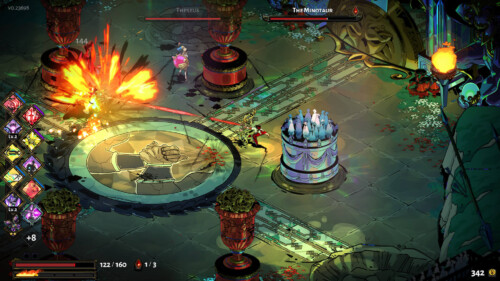
**What.** 최소 크롬, 좌상단 HP/자원, 우하단 어빌리티. **Why.** HUD를 가장자리로 밀고 중앙을 비워 전투 가독성 유지. → 적용: 중앙 비움, 최소 크롬; 생명 자원 좌상단(2·3·4·5), 스킬/궁극기 하단(8·9).

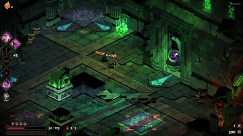
**What.** 자원/쿨다운을 라디얼/게이지로 표시. **Why.** 텍스트 없이 자원/쿨다운 읽기. → 적용: 스킬 라디얼(8)·궁극기 게이지(9).

> 글로: 타이머는 보통 **상단 중앙/상단 우측**에 두지만, 여기서는 **좌상단 고정 알람시계(다이제틱)** 다(의도적 예외 — UX rationale 참고). XP = 최상단의 얇은 전폭 띠.

#### Wireframe
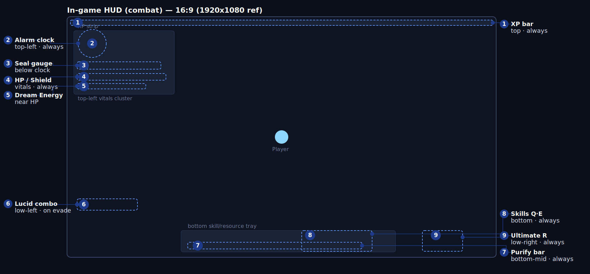

```text
┌──────────────────── 16:9 ────────────────────┐
│ (1)──── XP strip ─────────────────────────────│
│ (2)Alarm  (3)Seal  (4)HP/Shield (5)DreamEnergy│
│                   · Player ·                   │
│ (6)Lucid combo                                 │
│      (7)Purify bar     (8)Skills Q·E  (9)Ult R │
└────────────────────────────────────────────────┘
```

#### Legend
| # | code | 요소 | 위치 | 표시 | 동작/상태 | 데이터 바인딩 | 기준 | UX 의도 | a11y |
| --- | --- | --- | --- | --- | --- | --- | --- | --- | --- |
| 1 | A1 | XP 바 | 상단 전폭 | 항상 | 0→100% 채움; 레벨업 시 플래시+리셋 | XP(§4-5), `RunTelemetry.level_reached`(§12-2); 이벤트 UI-proposed | ≤200ms 반영 | 다음 성장까지 진행 | 채움+숫자, 색만으로 X |
| 2 | A2 | 알람시계 | 좌상단 | 항상 | 바늘 회전; 1140–1200s 가장자리 밝아짐 + 바늘 강조(§4-1) | `run.timer` 0–1200s(§4-1), `AlarmReached`(§12-1) | 언제든 남은 시간 ≤1s 가독(§3-2) | 최상위 규칙 가시성 | 시계+숫자, 마지막 60s 사운드+밝기 |
| 3 | A3 | 봉인 게이지 | 시계 아래 | 항상 | 4 봉인; 보스 처치 시 점등 | 봉인 슬롯(§4-2), `BossDefeated`(§12-1) | 해제 시 ≤300ms 점등 | 조기 클리어 진행 | 핍+자물쇠/해제 아이콘 |
| 4 | A4 | HP/Shield | 좌상단 | 항상 | 피격 시 감소+적색 점멸; 실드 별색; 저체력 테두리 | `Character.hp`(§12-2), shield(§12-2 추가) | 피격 ≤100ms 반영; 저체력(≤25% [TBD]) 색+점멸+테두리 | 빈사를 형태로도 | 색+점멸+테두리+숫자 |
| 5 | A5 | Dream Energy | HP 근처 | 항상 | 회피/처치로 충전; 만충 = 궁극기 준비 신호 | dream energy(§4-3·§4-6; 필드 §12-2 추가), `EvasionLucid`/`EvasionNearMiss`(§4-3) | 만충 → A9와 동시 신호 | 궁극기 타이밍 예고 | 채움+숫자+아이콘 |
| 6 | A6 | 루시드 콤보 | 좌측 하단 | 회피 후 6s | 콤보 1→3 + 배율; 6s간 연속 없으면 사라짐 | `LucidComboStep`(§4-3), 최대 3(§4-3) | ≤0.2s 갱신; 6.0s 유지(§4-3) | 회피 리듬 보상 | 단계+색+사운드 |
| 7 | A7 | 정화 바 | 하단 중앙 | 항상 | 슬롯 임계치까지 채움; 임계 시 보스 경고 | 정화(§4-2 임계 260/620/1080/1640), `PurgeGained`·`BossThresholdReached`(§12-1) | 획득 ≤200ms; 임계→경고 즉시 | 다음 보스까지 거리 | 채움+숫자+출처 토스트 |
| 8 | A8 | 스킬 Q·E | 하단 | 항상 | 쿨다운 라디얼; 준비 플래시; 눌림+SFX | 스킬 쿨(§2-5; 필드 §12-2 추가) | 쿨 후 준비 플래시 ≤200ms | 쓸 수 있나? 얼마나? | 라디얼+키캡+사운드 |
| 9 | A9 | 궁극기 게이지 R | 우측 하단 | 항상 | dream energy 100에서 점등; 사용 시 시네마틱 | dream/100(§4-6), R(§2-5) | 100에서 즉시 점등; 입력 ≤100ms | 마무리 자원 구분 | 채움+숫자+점등 |

#### State matrix (핵심 동적 요소)
| 요소 | default | pressed/active | disabled/locked | loading | empty | error |
| --- | --- | --- | --- | --- | --- | --- |
| 스킬 (A8) | 라디얼 채움 | 눌림+SFX, 라디얼 0 | 회색+자물쇠+"추후 해금"(트리 이전) | 진입 페이드 | N/A | "쿨 오류 — 기본값" |
| 궁극기 (A9) | 충전 채움 | 발동 시 시네마틱 | <100이면 흐림+잔여 | 진입 페이드 | N/A | 자원 누락 = 마지막 값+테두리 |
| HP/Shield (A4) | 현재 | 피격 시 적색 점멸 | N/A | 진입 채움 | HP0 = FailedWake 전이 | 누락 = 마지막 값+테두리 |
| 루시드 콤보 (A6) | 숨김 | 회피 시 등장+증가 | N/A | 등장 애니메이션 | 6s 후 사라짐 | N/A |
| 알람 (A2) | 일반 | 60s 경고: 밝기+바늘 | N/A | 진입 설정 | N/A | 누락 = "동기화 중…" + 마지막 |

#### Input parity
| action | key | pad | screen reader |
| --- | --- | --- | --- |
| 이동 | WASD | 좌 스틱 | "이동" |
| 대시/회피 | Space | A/○ | "회피, 쿨 n s" |
| 스킬 1·2 | Q·E | LB·RB | "스킬1 준비/쿨" |
| 궁극기 | R | Y/△ | "궁극기 준비/충전 n%" |
| 카메라/핑 | 단축키 | 우 스틱/D-Pad | "핑" |

#### Data binding (이벤트 기반)
| code | field (GDD §) | event (GDD §12-1/§4-3) | UI-proposed (추가 필요) | format | fallback |
| --- | --- | --- | --- | --- | --- |
| A1 | XP(§4-5); `level_reached`(§12-2) | — | `XpChanged`, `LevelReached` | 0–100%+Lv | 0% |
| A2 | `run.timer` 0–1200s(§4-1) | `AlarmReached`(§12-1) | `RunTimerTick` | mm:ss 남음 | 0:00 |
| A3 | 봉인(§4-2); `Boss.seal_slot`(§12-2) | `BossDefeated`·`BossThresholdReached`(§12-1) | `SealStateChanged` | 4 pips | 0 |
| A4 | `Character.hp`(§12-2); shield(§12-2 추가) | — | `HpChanged`, `ShieldChanged` | n/max | last |
| A5 | dream energy(§4-3·§4-6; 필드 §12-2 추가) | `EvasionLucid`·`EvasionNearMiss`(§4-3) | `DreamEnergyChanged` | n/100 | 0 |
| A6 | 콤보 단계(§4-3; 필드 §12-2 추가) | `LucidComboStep`(§4-3) | — | x1–x3 | hidden |
| A7 | 정화(§4-2; 필드 §12-2 추가) | `PurgeGained`·`BossThresholdReached`(§12-1) | `PurgeGaugeChanged` | n/thr | 0 |
| A8 | 스킬 쿨(§2-5; 필드 §12-2 추가) | — | `SkillCooldownChanged`, `SkillReady` | s 남음 | ready |
| A9 | dream/100(§4-6) | — | `UltimateChargeChanged`, `UltimateReady` | n/100 | 0 |

> **UI 이벤트/필드 — GDD 추가 필요:** 런타임 상태 `RunState{timer, purge_current, seal_slot_index}`, `PlayerRuntime{hp_current, shield_current, dream_energy, ultimate_charge, lucid_combo_step}`, `SkillSlot{cooldown_remaining}` 는 §12-2에 없음. **XP 바도 §9-2에 없음** → UI-proposed. 이들이 §12-1 이벤트에 바인딩된다고 주장하지 않는다.

#### Navigation
라우팅 없음(표시 전용). 상태 전이만: `NormalRun`→I3/I5/I2/I6.

#### Edge cases
동시 종료(§4-1): 7:00 + 보스 처치 → `DawnWake` 우선(보스 보상 없음); 7:00 시점에 레벨업 열려 있으면 → 창 닫고 `DawnWake`. 7:00에 궁극기 시네마틱 → 컷/페이드 후 `DawnWake`. 데이터 폭주: 토스트 병합/스로틀. 값 누락: 마지막 값 + 테두리.

#### Accessibility
색약 팔레트가 적 탄 / 아군 탄 / 위험 지대를 형태+색으로 구분(§9-3). 흔들림/후처리 강도, 히트 판정 표시(§9-3). 저체력/임계 = 색+점멸+사운드(삼중).

#### UX rationale
- **한눈에 읽히게**: 첫 가독 ① 7:00까지 시간(좌상단 알람), ② HP(좌상단), ③ 다음 보스까지 정화(하단). 행동 자원은 손이 있는 하단/우측 하단. 중앙은 비워 탄/예고/캐릭터가 보이게.
- **조작·실수 방지**: 스킬/궁극기가 "지금 쓸 수 있나?"를 라디얼 채움 + 키 글리프로 — 암기 불필요. 자원 부족 = 흐림 + 잔여.
- **재미·손맛**: 루시드 회피가 콤보를 즉시 띄움; dream energy 만충은 자원 바와 궁극기 슬롯 양쪽에 신호. 연출은 절제해 정보를 묻지 않음.
- **첫 플레이 vs 반복**: 낯선 정보(콤보/정화)는 첫 등장 때 표시(평소 콤보 숨김); 베테랑은 고정 위치를 빠르게 읽음.
- **접근성**: 위험/저체력/임계를 색만으로 X.
- **특히 조심할 점**: ① 물량 속 위험 묻힘(§13-3 #5) → HUD를 가장자리로, 중앙 비움, 위험을 형태로도; ② 알람이 좌상단이라 시간 놓침 → 마지막 60s 가장자리 밝기+사운드(보스전 처리는 I2); ③ 연출이 정보 가림 → 절제+토글; ④ 정화/봉인/dream 혼동 → 색+위치+아이콘 구분, 의미 라벨.

#### Open questions
저체력 임계 %(현재 25%). XP 바를 §9-2로 승격. 정화(A7) vs 봉인(A3) 의미 중복 검증.

#### Acceptance
- [ ] 임의 스크린샷에서 7:00까지 시간을 1초 안에 읽을 수 있다.
- [ ] 적 180마리에서 색약 모드로도 플레이어/치명 탄/구역이 구분된다.
- [ ] 피격이 100ms 안에 색+점멸+테두리로 HP 감소 반영.
- [ ] dream 100에서 자원 바와 궁극기 슬롯이 함께 신호.
- [ ] 패드만으로 모든 전투 행동 수행.

---

### 5.I2 HUD-BOSS — 인게임 HUD (보스 / 히든 보스) · state: `BossFight` · `HiddenBossAttempt`

#### Purpose
생존/시간 정보를 잃지 않으면서 **보스 HP · 페이즈 · 실드 크랙/그로기 · 카운터 윈도우**를 추가한다. 핵심: **상단 중앙 슬롯을 보스 HP 바가 점유**.

| field | value |
| --- | --- |
| Enter | `BossSpawned`/`HiddenBossSpawned`(§12-1) |
| Exit | `BossDefeated`→I4 / `AlarmReached`→DawnWake / `DreamBreakAchieved`→I6 |
| Input context | 실시간 (보스 + 약화된 웨이브 45%/히든 25% — §6-4) |
| Priority | core |

#### References
*출처: ui-ref 수집 — interfaceingame; 보스 바 점유는 글로(이번 수집에 깔끔한 보스 바 캡처 없음).*

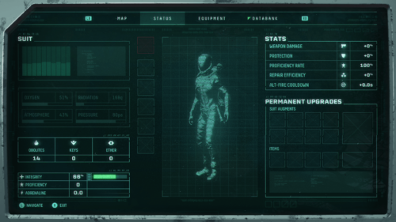
**What.** 적/위협 상태를 플레이어 HUD와 분리해 강조. **Why.** "깨부술 기회"를 부각. → 적용: 실드 크랙/그로기(11)·카운터 윈도우(12).

> **의도적 예외 (중요):** survivor-like 표준은 "타이머 상단 중앙 → 보스 HP가 그 슬롯 점유". 여기서 타이머는 **알람시계(월드 오브젝트), 좌상단 고정**이다. 대신 **상단 중앙 슬롯은 평상시 비워두고 전투 중 보스 HP 바가 점유**한다(같은 물리 슬롯을 시간대로 공유). 안전장치: ① 보스전 중에도 알람시계는 좌상단 유지; ② 히든 보스전에서는 §4-1대로 **남은 시간을 보스 바 안에 인셋**. 보스 바 = 상단 중앙, HP55% 페이즈에서 세그먼트(§7-1), 보스 NAME 표기(LoL Swarm / GUIDB 패턴, §B-2).

#### Wireframe
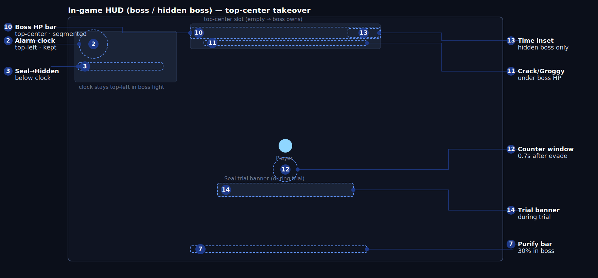

#### Legend
| # | code | 요소 | 위치 | 표시 | 동작/상태 | 데이터 바인딩 | 기준 | UX 의도 | a11y |
| --- | --- | --- | --- | --- | --- | --- | --- | --- | --- |
| 10 | A10 | 보스 HP 바 | 상단 중앙 | 보스/히든 | 수평 채움; HP55% 페이즈 세그먼트(§7-1); 보스 이름 | `Boss.hp`·`phase_rules`(§12-2), `BossSpawned`(§12-1) | 피격 ≤100ms; 55%에서 페이즈 전환 | 위협/잔량을 항상 위에 | 채움+세그먼트선+숫자 |
| 2 | A2 | 알람시계 | 좌상단 | 보스전에도 유지 | I1과 동일 | `run.timer`(§4-1) | 시간 가독 ≤1s 유지 | 시간 압박 유지 | I1과 동일 |
| 3 | A3 | 봉인→히든 | 시계 아래 | 항상 | 4 봉인 시 게이지가 히든 보스 게이지로 전환(§4-2) | 봉인/히든(§4-2), `HiddenBossSpawned`(§12-1) | 4 봉인에서 전환 | 스테이지 전환 명확 | 형태 변화+라벨 |
| 11 | A11 | 실드 크랙/그로기 | 보스 HP 아래 | 보스 | 크랙 누적; 100→4s 그로기(×1.35 피해)(§7-1) | `BossPattern.shield_crack_value`·`groggy_interaction`(§12-2), `EvasionBossLucid`(§4-3) | 보스-루시드 카운터 시 크랙 ++; 100→그로기 4.0s | 깨부술 기회 | 별도 바+그로기 아이콘+사운드 |
| 12 | A12 | 카운터 윈도우 | 플레이어 근처 | 루시드 회피 후 0.7s | 짧게 점등; 카운터 유도 | `LucidCounterWindowOpen`(§12-1), 0.7s(§4-3) | 회피 시 즉시 점등, 0.7s | 카운터 타이밍 손맛 | 점등+사운드+색/형태 |
| 13 | A13 | 시간 인셋 | 보스 HP 내부 | 히든 보스만 | 보스 바 안에 남은 시간 인셋 | `run.timer`(§4-1), `HiddenBossSpawned`(§12-1) | 히든 시 즉시 인셋 표시 | 시간+HP 동시 | 숫자+바, 좌상단 시계와 이중 |
| 14 | A14 | 봉인 시련 배너 | 중앙 하단 | 시련 중(§7-2) | 시련명·제한 시간·목표; 카운트다운 | `DreamBreakTrial.id`·`duration_limit`·`success_condition`(§12-2) | 시련 시작 시 표시; 1s 틱 | 시련 목표/시간 명확 | 텍스트+카운트다운+색 |
| 7 | A7 | 정화 바 | 하단 중앙 | 보스 | 일반 적 정화의 30%만(§4-2 BossActive) | 정화(§4-2), `PurgeGained`(§12-1) | 보스전 30% 비율 | 진행 맥락 유지 | 채움+숫자 |

#### State matrix (보스 추가분)
| 요소 | default | active | groggy/special | locked | loading | error |
| --- | --- | --- | --- | --- | --- | --- |
| 보스 HP (A10) | 채움+이름 | 피격 플래시 | 그로기: 대비+아이콘+×1.35 표시 | 보스 아닐 때 숨김(빈 슬롯) | 진입 슬라이드 | 누락 = 마지막+테두리 |
| 실드 크랙 (A11) | 0 | 카운터 시 ++ | 100→그로기 전환 | N/A | — | 누락 = 마지막 |
| 카운터 윈도우 (A12) | 숨김 | 회피 후 0.7s 점등 | — | 궁극기 i-frame 중 판정 없음(§4-3) | — | N/A |
| 시간 인셋 (A13) | 숨김(일반 보스) | 히든 전투 시 표시 | 60s 경고 강조 | — | 진입 | 누락 = 좌상단 시계로 폴백 |

#### Input parity
I1과 동일(전투 공유). 추가로 **카운터**가 루시드 회피 후 0.7s 안에 발동(§4-4 루시드 카운터 28). 패드/키 동일.

#### Data binding
| code | field (GDD §) | event | UI-proposed (추가 필요) | format | fallback |
| --- | --- | --- | --- | --- | --- |
| A10 | `Boss.hp`·`phase_rules`·`pattern_list`(§12-2) | `BossSpawned`(§12-1) | `BossHpChanged`, `BossPhaseChanged` | n/max+phase | last |
| A11 | `BossPattern.shield_crack_value`·`groggy_interaction`(§12-2) | `EvasionBossLucid`(§4-3) | `ShieldCrackChanged`, `GroggyChanged` | n/100 | 0 |
| A12 | 0.7s 윈도우(§4-3) | `LucidCounterWindowOpen`(§12-1) | — | on/off | off |
| A13 | `run.timer`(§4-1) | `HiddenBossSpawned`(§12-1) | `RunTimerTick` | mm:ss | 좌상단 시계 |
| A14 | `DreamBreakTrial.*`(§12-2) | — | `TrialStarted`, `TrialTick`, `TrialResult` | name+countdown | hidden |

#### Navigation
`BossFight`→(처치)→I4 / (HP0)→FailedWake(I6) / (7:00)→DawnWake(I6). `HiddenBossAttempt`→(처치)→DreamBreak(I6) / (7:00)→DawnWake.

#### Edge cases
Dream Break 컷씬 시작 후 7:00: 처치 이벤트가 이미 확정됐으면 `DreamBreak` 유지(§4-1). 화면 밖 공격 없음(§4-3): 예고는 화면 안에서만. 보스/히든 중 엘리트 없음(§6-4).

#### Accessibility
보스 예고는 색+형태+선행 시간으로 다중화(§4-3). 그로기/카운터는 사운드+아이콘. 컷인 간소화 토글(§9-3). 히든 보스 시간은 좌상단 시계와 이중 표시.

#### UX rationale
- **한눈에 읽히게**: 전투 시 큰 보스 바가 상단 중앙에 떠 "누구와 싸우나"가 명확 — 그래서 슬롯을 비워둔 것. 시간(좌상단)과 HP(좌상단)는 그대로.
- **조작·실수 방지**: 보스를 깨는 경로(크랙→그로기)와 카운터 순간(0.7s)을 따로 보여줘 "언제 욕심낼지"가 명확.
- **재미·손맛**: 루시드 카운터 → 크랙 충전 → 그로기 → 더 강한 타격: "리스크를 보상으로" 핵심이 보스전에서 증폭.
- **첫 플레이 vs 반복**: 시련 배너가 초심자에게 목표/시간을 명시; 베테랑은 그로기를 노려 처치 시간 단축.
- **접근성**: 예고는 색+형태+시간; 컷인 토글; 시간 이중 표시.
- **특히 조심할 점**: ① 알람이 좌상단이라 시간 놓침 → 시계 유지 + 히든 보스 시간 인셋(이중); ② 보스 바+크랙+카운터 난잡 → 상단(HP)–아래(크랙)–플레이어 근처(카운터)로 분리; ③ 연출이 예고 가림 → 컷인 토글, 예고는 최상위 레이어; ④ 동시 종료 혼동 → §4-1 우선순위, 확정된 Dream Break만 컷씬 유지.

#### Open questions
보스 HP 세그먼트 수(현재 55%만). 카운터 윈도우(A12) 월드 공간 vs HUD.

#### Acceptance
- [ ] 보스 등장 시 보스 HP가 상단 중앙을 점유하면서 좌상단 시계는 계속 보임.
- [ ] 히든 보스전에서 보스 바가 인셋 남은 시간을 동시에 표시.
- [ ] 보스-루시드 카운터 성공 시 크랙 증가; 100에서 그로기로 전환.
- [ ] 색약 모드에서 보스 바 / 크랙 / 카운터 윈도우를 형태로 구분.

---

### 5.I3 LVLUP — 레벨업 / 아이템 선택 · state: `NormalRun` (일시정지) 오버레이 모달

#### Purpose
레벨업 시 **전투를 멈추고** 3장의 카드 중 하나를 골라 빌드를 키운다 — 카드 1장을 ~1초에 읽고 **현재 빌드/시너지를 보면서** 결정한다.

| field | value |
| --- | --- |
| Enter | `RunTelemetry.level_reached` ++ (§4-5) |
| Exit | 카드 확정 → `NormalRun` / 7:00 → 닫은 뒤 `DawnWake`(§4-1) |
| Input context | **일시정지** |
| Priority | core |

#### References
*출처: ui-ref 수집 — interfaceingame (부운/카드 선택).*

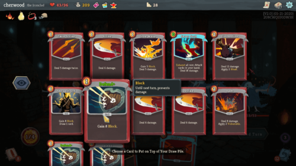
**What.** 카드 그리드, 효과 호버 툴팁, "Choose a Card" 프롬프트, 상단 화폐. **Why.** 카드 = 아이콘+이름+효과가 1초에 읽히고, 호버로 상세 제공. → 적용: 카드(4)·희귀도(5)·증감/설명(6)·프롬프트(7).

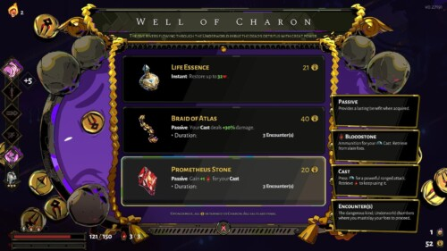
**What.** 보상 후보를 짧은 효과가 달린 카드/아이콘으로. **Why.** 보상 명료성. → 적용: 간결한 카드 효과.

> 글로: **일시정지 + 3–4장 카드**(Vampire Survivors), **선택 명료성 + 희귀도 색**(Hades), **고르면서 현재 빌드 검토**(20MTD의 빈틈) → 현재 빌드 패널(3).

#### Wireframe
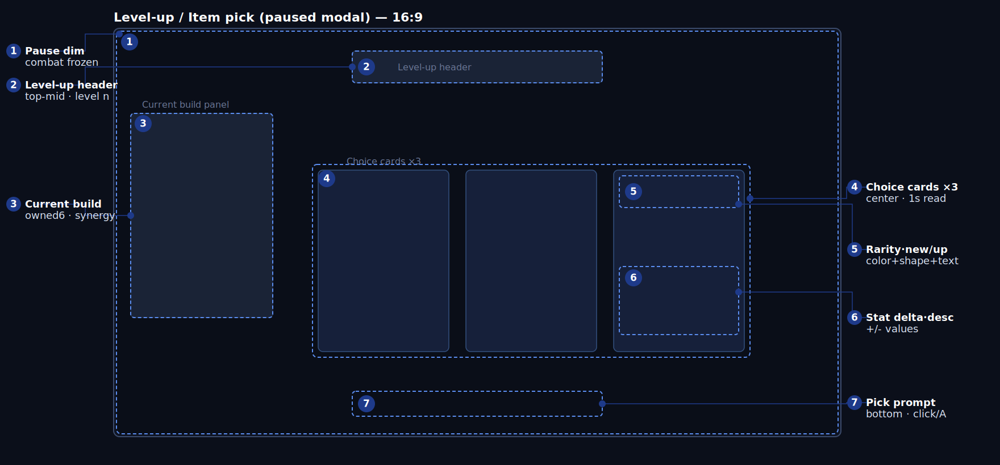

#### Legend
| # | code | 요소 | 위치 | 표시 | 동작/상태 | 데이터 바인딩 | 기준 | UX 의도 | a11y |
| --- | --- | --- | --- | --- | --- | --- | --- | --- | --- |
| 1 | B1 | 일시정지 딤 | 전체 | 모달 | 전투 정지 + 딤 | 전투 정지(레벨업) | 즉시 정지(입력 손실 0) | 시간 압박/긴장 제거 | 딤 + 입력 차단 안내 |
| 2 | B2 | 레벨업 헤더 | 상단 중앙 | 모달 | "Level n reached" + 연출 | `level_reached`(§12-2) | 레벨업 시 갱신 | 무슨 일인지 한 줄 | 텍스트+아이콘+사운드 |
| 3 | B3 | 현재 빌드 | 좌측 | 모달 | 보유 아이템(≤6)·레벨·시너지(읽기 전용) | `Item.*`(§12-2), 최대 6(§4-5) | 선택 전 항상 보임 | 시너지로 선택 | 아이콘+이름+레벨 |
| 4 | B4 | 선택 카드 ×3 | 중앙 | 모달 | 3장; 아이콘+이름+효과; 포커스 강조; 확정 | `RewardScreenRule.item_offer_count`(§12-2); 일반 3(§4-5) | 카드 1장 ≤1s 가독; 선택 ≤100ms | 방향을 빠르게 선택 | 포커스 링 ≥3:1, 라벨 |
| 5 | B5 | 희귀도·new/upgrade | 카드 위 | 모달 | 희귀도 = 색+테두리+코너; new/upgrade 배지 | `Item.rarity`(§12-2); 확률(§4-5) | 희귀도를 형태/텍스트로도 | 희귀도 & 새 효과 동시 | 색+형태+텍스트 |
| 6 | B6 | 스탯 증감·설명 | 카드 하단 | 모달 | +/- 숫자 + 레벨 효과 | `Item.effect`(§12-2); 표(§4-5) | 부호+값 | 무엇이 좋아지나 | 부호+숫자 |
| 7 | B7 | 선택 프롬프트 | 하단 | 모달 | 기기 글리프 + 행동 | 입력(§2-5) | 기기 변경 시 교체 | 암기 불필요 | 기기 글리프 |

#### State matrix (카드 B4)
| 요소 | default | hover/focus | selected | disabled/locked | loading | empty | error |
| --- | --- | --- | --- | --- | --- | --- | --- |
| 카드 (B4) | 일반 | 강조+확대, 링 ≥3:1 | 확정 + 보석 + 짧은 i-frame | Lucid 카드: 자물쇠+"루시드 조건" 선조건(§4-5) | 딜링 애니메이션(≠ 데이터 없음) | "선택지 없음" 폴백 | "생성 오류 — 재시도" |
| 빌드 패널 (B3) | 보유 | 아이템 툴팁 | N/A | 보유 0 = "아직 없음" | 진입 페이드 | "아이템 없음" | "빌드 로드 오류" |
| 희귀도 (B5) | 희귀도 색+형태 | — | — | 최대치 아이템은 풀에서 제거(§4-5) | — | — | — |

#### Input parity
| action | mouse | key | pad | screen reader |
| --- | --- | --- | --- | --- |
| 카드 포커스 | hover | ←/→ | D-Pad/스틱 | "카드 2/3, Moonlit Ribbon" |
| 확정 | 클릭 | Enter | A/○ | "Moonlit Ribbon, 이동 +8%" |
| 빌드 검토 | hover | Tab | RB | "보유: Blue Pillow Lv.1" |

> 리롤 없음(§4-5) — 리롤 컨트롤 없음.

#### Data binding
| code | field (GDD §) | event | UI-proposed (추가 필요) | format | fallback |
| --- | --- | --- | --- | --- | --- |
| B2 | `level_reached`(§12-2) | — | `LevelReached` | "Level n" | last |
| B3 | `Item.*`(§12-2), ≤6(§4-5) | — | `InventoryChanged` | icon+Lv | "없음" |
| B4 | `RewardScreenRule.item_offer_count`·`rarity_guarantee`(§12-2), `ItemPoolRule.*`(§12-2) | — | `LevelUpOffer` | 3 cards | edge |
| B5 | `Item.rarity`(§12-2), `ItemPoolRule.base_weight`(§12-2) | — | — | rarity+badge | Common |
| B6 | `Item.effect`(§12-2), 표(§4-5) | — | — | ±value | "effect TBD" |

> 추가 필요: `LevelReached`, `InventoryChanged`, `LevelUpOffer`, `ItemPicked`(확정; `stacking_rule`/`category_limit`는 §12-2).

#### Navigation
모달 전용. 확정 → `NormalRun`(I1). 다중 레벨업은 큐로.

#### Edge cases
선택 규칙(§4-5): 첫 레벨업 = Common/Uncommon + 방어 ≥1 보장 / 일반 = 업그레이드 ≥1 + 신규 ≥1 / 보유 6 = 업그레이드만 / 카테고리-3 제한, 최대치는 제거. 빈 풀: 폴백 보상 1개 `[TBD]`. 선택 중 7:00(§4-1): 닫은 뒤 `DawnWake`(미선택 시 보상 없음). 급격한 다중 레벨업: 큐.

#### Accessibility
희귀도/신규는 색+테두리+코너 아이콘+텍스트(§9-3). 포커스 링 ≥3:1. 일시정지 = 시간 압박 없음. 텍스트 확대 가능.

#### UX rationale
- **한눈에 읽히게**: 정지 + 딤이 세 카드에 집중시킴; 아이콘=타입, 색/테두리=희귀도, 짧은 숫자=효과 → 1초에 읽힘.
- **조작·실수 방지**: 좌측 현재 빌드로 시너지를 보고 선택(많은 survivor-like가 놓치는 빈틈); 하단에 입력 글리프.
- **재미·손맛**: 확정 시 보석 + 짧은 i-frame — "성장했다" 비트; 높은 희귀도 = 더 화려한 연출.
- **첫 플레이 vs 반복**: 첫 레벨업은 방어를 심어 초심자가 무너지지 않게; 베테랑은 보장 규칙 안에서 빠르게 빌드.
- **접근성**: 희귀도를 색만으로 X.
- **특히 조심할 점**: ① 시너지를 모르고 선택 → 빌드 패널 상시 표시; ② 색약 희귀도 → 색+테두리+아이콘+텍스트; ③ 7:00 겹침 손실 → 규칙 기반 닫고 Dawn Wake; ④ 최대치/카테고리 오클릭 → 풀에서 제거 / 업그레이드로 표시.

#### Open questions
빈 풀 폴백 유형. 카드 확정 i-frame 길이.

#### Acceptance
- [ ] 레벨업이 전투를 즉시 멈추고 3장의 카드를 표시.
- [ ] 보유<6이면 신규 ≥1 + 업그레이드 ≥1 보장; 보유=6이면 업그레이드만.
- [ ] 첫 레벨업에 방어 아이템 ≥1 포함.
- [ ] 색약 모드에서 희귀도를 형태/텍스트로 구분.
- [ ] 패드만으로 포커스 & 확정.

---

### 5.I4 BOSSRWD — 보스 보상 (스킬 트리 → 4종 아이템 선택) · state: `BossReward` (8s 보호)

#### Purpose
보스/봉인 시련 처치 직후 **스킬 포인트를 지급**하고, **① 스킬 트리 노드 선택 → ② 별도의 4종 아이템 선택**을 진행한다. GDD §12-3: SP 지급과 아이템 선택 UI는 **분리**되며, 스킬 노드는 4종 선택에 섞지 않는다.

| field | value |
| --- | --- |
| Enter | `BossDefeated`(§12-1) → SP +1 (§7-1) |
| Exit | 2단계(4종 선택) 확정 → `NormalRun`(I1) |
| Input context | **8s 보호** (§7-1) |
| Priority | core |

#### References
*출처: ui-ref 수집 — interfaceingame (스킬 트리 / 보상).*


**What.** 강화 행/노드, 우상단 화폐, 우하단 선택 항목 설명. **Why.** 노드+설명으로 효과/비용/선행 확인. → 적용: 노드 그래프(4)·노드 상태(5)·노드 정보(6)·스킬 포인트(2).

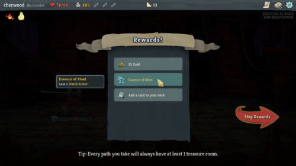
**What.** 보상 아이템을 카드/리스트로 선택. **Why.** 4종 아이템 선택에 동일 카드 문법 재사용. → 적용: 4종 선택(C-CARD, 4장, Rare 보장).

> 글로: 영구 성장(트리)과 런 보상(아이템)을 **단계로 분리**(§12-3); 4종 선택에 노드 없음.

#### Wireframe (1단계: 스킬 트리)
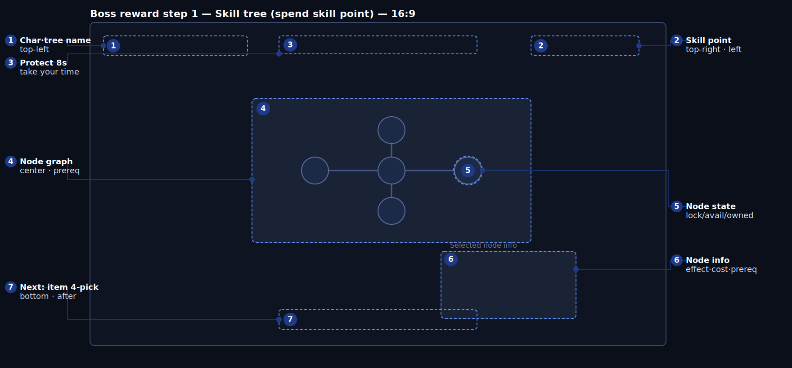
> 2단계 4종 아이템 선택은 §I3 카드(C-CARD)를 **4장, Rare 보장**으로 재사용(아래 표).

#### Legend (1단계 스킬 트리)
| # | code | 요소 | 위치 | 표시 | 동작/상태 | 데이터 바인딩 | 기준 | UX 의도 | a11y |
| --- | --- | --- | --- | --- | --- | --- | --- | --- | --- |
| 1 | C1 | 캐릭터·트리명 | 좌상단 | 항상 | 해당 캐릭터 전용 트리 | `Character.id`·`SkillNode.character_scope`(§12-2) | 진입 시 표시 | 누구 트리인가 | 텍스트+초상 |
| 2 | C2 | 스킬 포인트 | 우상단 | 항상 | 잔여 SP; 사용 시 감소 | `RewardScreenRule.skill_point_delta`(§12-2), 보스 +1(§7-1) | 처치 시 즉시 +1 | 무엇을 쓸 수 있나 | 숫자+아이콘 |
| 3 | C3 | 보호 8s | 상단 | 진입 8s | "천천히" + 잔여 | `RewardScreenRule.timeout_rule`(§12-2), 8s(§7-1) | 8.0s 보호 | 서두르지 않는 선택 | 텍스트+카운트다운+사운드 |
| 4 | C4 | 노드 그래프 | 중앙 | 항상 | 노드 + 선행 엣지; 캐릭터당 노드 4개(§5) | `SkillNode.id`·`prerequisite`·`offered_after_boss`(§12-2) | 처치 후 선택 가능(§4-5) | 성장 경로 | 노드+엣지 |
| 5 | C5 | 노드 상태 | 그래프 | 항상 | locked/available/owned | `SkillNode.prerequisite`·`cost`(§12-2) | 선행+SP 충족 시 "available" | 무엇을 가질 수 있나 | 자물쇠/테두리/채움 |
| 6 | C6 | 노드 정보 | 우측 하단 | 포커스 시 | 효과·비용·선행 | `SkillNode.effect`·`cost`·`prerequisite`(§12-2) | 포커스 시 갱신 | 선택 전 확인 | 제목+상세 |
| 7 | C7 | 다음: 4종 선택 | 하단 | SP 사용/스킵 후 | 2단계로 이동 | `RewardScreenRule.step_order`(§12-2/§12-3) | 트리 → 4종 전환 | 보상 순서 명확 | 버튼+프롬프트 |

#### 2단계: 4종 아이템 선택 (C-CARD 재사용)
트리 후, 4종 선택을 위한 **별도 화면**(§7-1, §12-3). 카드 컴포넌트/상태/a11y는 I3 B4–B6과 동일, 단:
| 항목 | 값 (GDD §) |
| --- | --- |
| 카드 | **4** (`RewardScreenRule.item_offer_count`, §4-5) |
| 보장 | **Rare ≥1**, 스킬 노드 없음(§4-5, §12-3) |
| Dream Break 루트 | Blue Second-Hand · Starlight Lens · 루시드 라인 가중(§4-5) |
| 엘리트 보상 (참고) | 카드 3장, Uncommon ≥1(§4-5) |

#### State matrix (노드 C5 / 4종 선택 카드)
| 요소 | default | hover/focus | selected | disabled/locked | loading | empty | error |
| --- | --- | --- | --- | --- | --- | --- | --- |
| 노드 (C5) | 보유=채움/그외=외곽선 | 강조+정보 | 방금 획득 | 선행 미충족=자물쇠+"선행 필요" / SP 부족="포인트 부족" | 진입 페이드 | N/A: 노드 4개 | "트리 로드 오류" |
| 4종 선택 카드 | 일반 | 강조+링 | 확정+보석 | 최대치 숨김(§4-5) | 딜링 애니메이션 | "선택지 없음" | "생성 오류" |

#### Input parity
| action | mouse | key | pad | screen reader |
| --- | --- | --- | --- | --- |
| 노드 포커스 | hover | 방향키 | D-Pad/스틱 | "Steady Counter, 비용 1" |
| 노드 확정 | 클릭 | Enter | A/○ | "Steady Counter 획득, SP 0" |
| 다음/스킵 | 클릭 | Esc/Enter | B/A | "4종 선택으로" |
| 아이템 선택 | 클릭 | Enter | A | "Starlight Lens 선택" |

#### Data binding
| code | field (GDD §) | event | UI-proposed (추가 필요) | format | fallback |
| --- | --- | --- | --- | --- | --- |
| C2 | `RewardScreenRule.skill_point_delta`(§12-2) | `BossDefeated`(§12-1) | `SkillPointChanged` | int | 0 |
| C4·C5 | `SkillNode.*`(§12-2) | `BossDefeated`(§12-1) | `SkillTreeOpened`, `NodeStateChanged` | graph | read-only |
| C6 | `SkillNode.effect`·`cost`·`prerequisite`(§12-2) | — | `NodeFocused` | detail | "노드 선택" |
| C7/4종 | `RewardScreenRule.step_order`·`item_offer_count`·`rarity_guarantee`(§12-2) | `BossDefeated`(§12-1) | `RewardStepAdvanced`, `BossItemOffer` | 4 cards | edge |

> 추가 필요: `SkillPointChanged/SkillTreeOpened/NodeStateChanged/NodeFocused/NodePicked/RewardStepAdvanced/BossItemOffer/ItemPicked`.

#### Navigation
1단계(트리) → C7 → 2단계(4종 선택) → 확정 → `NormalRun`(I1). 봉인 시련 보상은 단축형으로 재사용(§7-2: Seal 3 Trial = Rare 선택).

#### Edge cases
보상 순서 고정(§7-1): HP0 시, `BossDefeated`가 SP+1 & 정화 보너스를 먼저 지급 → 8s 보호 중 트리 → 그다음 4종 선택. SP 0/스킵: 미획득으로 진행(SP 이월). 8s 종료: 자동 진행, 미사용 SP 유지(가정) `[TBD]`. Dream Break 루트 가중(§4-5).

#### Accessibility
노드 상태는 색+자물쇠/테두리/채움(§9-3). 8s 보호 = 시간 압박 없음. 정보 패널 확대 가능; 포커스 순서 번호화; 4종 선택은 I3 a11y 상속.

#### UX rationale
- **한눈에 읽히게**: 영구 성장(트리)과 런 보상(4종 선택)을 단계로 분리해 흐려지지 않게. 트리는 노드+엣지로 "지금 가질 수 있는 것 / 다음에 열리는 것"을 보여줌.
- **조작·실수 방지**: 노드 포커스 시 확정 전 효과/비용/선행 표시; 8s 보호가 오클릭을 줄이고 미사용 포인트 이월.
- **재미·손맛**: 스킬 포인트를 먼저 지급해 "보스를 이겼다"를 각인.
- **첫 플레이 vs 반복**: 보호 덕에 초심자는 읽고, 베테랑은 추천 노드(§7-1)를 빠르게 잡고 4종 선택으로.
- **접근성**: 노드 상태를 색만으로 X.
- **특히 조심할 점**: ① 노드/아이템 혼동 → 단계 분리, 4종 선택에 노드 없음; ② 선행/포인트 오클릭 → 색+자물쇠+텍스트; ③ 보상 순서 꼬임 → SP 먼저, 순서 강제; ④ 8s가 쫓기는 느낌 → "천천히" + 포인트 유지.

#### Open questions
8s 종료 시 미사용 SP/아이템. 캐릭터별 트리를 별도 화면 vs 공유 프레임(현재 공유).

#### Acceptance
- [ ] 처치 시 SP+1 먼저 지급, 그다음 트리 → 4종 선택 순서.
- [ ] 4종 선택은 카드 4장, Rare ≥1, 스킬 노드 없음.
- [ ] 선행 미충족/포인트 부족 노드는 색+자물쇠+텍스트 표시.
- [ ] 8s 보호 중 천천히 선택 가능; 스킵 시 포인트 유지.
- [ ] 패드만으로 노드 & 4종 선택.

---

### 5.I5 PAUSE — 일시정지 메뉴 · state: `NormalRun`/`BossFight` 일시정지

#### Purpose
전투 중 ESC/Start로 필드를 멈추고 재개/설정/조작/메인/종료를 고른다. 재개 시 재정렬을 돕는 런 요약 표시.

| field | value |
| --- | --- |
| Enter | ESC / Start (전투 중) |
| Exit | 재개 → 전투 / 설정 → O4 / 메인·종료 → 확인 후 |
| Input context | **일시정지** |
| Priority | core |

#### References
*출처: ui-ref 수집 — interfaceingame (일시정지).*

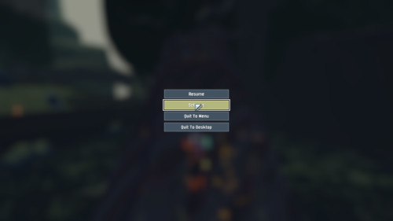
**What.** 딤 처리된 필드에 중앙 세로 메뉴(Resume/Settings/Quit to Menu/Quit to Desktop). **Why.** 일시정지는 짧은 중앙 세로 메뉴가 최적 — 빠르게 재개하거나 나가기. → 적용: 딤(1)·중앙 메뉴(2)·하이라이트(3)·입력(5).

> 글로: 재개 시 재정렬을 위한 **런 요약(4)**(시간/정화/봉인) 추가; 메인/종료는 진행도 손실 → 확인.

#### Wireframe
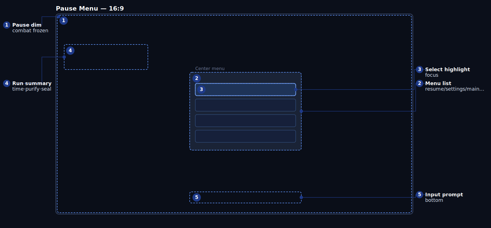

#### Legend
| # | code | 요소 | 위치 | 표시 | 동작/상태 | 데이터 바인딩 | 기준 | UX 의도 | a11y |
| --- | --- | --- | --- | --- | --- | --- | --- | --- | --- |
| 1 | Z1 | 일시정지 딤 | 전체 | 메뉴 | 전투 정지 + 딤 | 정지(ESC) | 즉시 정지 | 명확히 멈춤 | 딤 + 입력 차단 안내 |
| 2 | Z2 | 메뉴 리스트 | 중앙 | 메뉴 | 재개/설정/조작/메인으로/종료 | 메뉴(정적) | 선택 ≤100ms | 빠른 재개/나가기 | 라벨+포커스 |
| 3 | Z3 | 선택 하이라이트 | 항목 | 메뉴 | 포커스 강조 + SFX | 입력 포커스 | 이동 시 강조 | 내가 어디 있나 | 테두리+색+사운드 |
| 4 | Z4 | 런 요약 | 좌상단 | 메뉴 | 남은 시간·정화·봉인 진행 | `run.timer`(§4-1)·정화(§4-2)·봉인(§4-2) | 열 때 스냅샷 | 재정렬 | 텍스트+숫자 |
| 5 | Z5 | 입력 프롬프트 | 하단 | 메뉴 | 기기 프롬프트 | 입력(§2-5) | 기기 변경 시 교체 | 어떻게 조작하나 | 기기 글리프 |

#### State matrix (Z2/Z3)
| 요소 | default | hover/focus | pressed | disabled | loading | error |
| --- | --- | --- | --- | --- | --- | --- |
| 메뉴 항목 (Z2) | 일반 | 강조+SFX, 링 ≥3:1 | 눌림 | — | N/A | "메뉴 오류" |
| 하이라이트 (Z3) | Resume 기본 포커스 | 추적 | — | — | — | — |
| 런 요약 (Z4) | 값 | — | — | — | 열 때 스냅샷 | 누락 = "—" |

#### Input parity
| action | mouse | key | pad | screen reader |
| --- | --- | --- | --- | --- |
| 열기/닫기 | — | ESC | Start | "일시정지" |
| 이동 | hover | ↑/↓ | D-Pad | "Resume, 1/5" |
| 실행 | 클릭 | Enter | A/○ | "Resume 실행" |
| 메인/종료 | 클릭 | — | — | "메인으로, 진행도 손실 확인" |

#### Data binding
| code | field (GDD §) | event | UI-proposed (추가 필요) | format | fallback |
| --- | --- | --- | --- | --- | --- |
| Z2 | 메뉴(정적) | — | `PauseFocusChanged` | items | 기본 |
| Z4 | `run.timer`(§4-1)·정화(§4-2)·봉인(§4-2) | `PurgeGained`(§12-1) | `RunSummarySnapshot` | numbers | "—" |

> 추가 필요: `PauseOpened/PauseClosed`, `RunSummarySnapshot`.

#### Navigation
재개 → 전투. 설정 → O4(복귀 시 재정지). 메인으로/종료 → 확인 모달 후 나가기(I6 없음, 진행도 포기). 조작 → 조작 오버레이.

#### Edge cases
메인/종료는 진행도 포기(되돌릴 수 없음) → 확인. 보스전에서도 일시정지 허용(솔로); 코옵(범위 밖)은 다름. 일시정지 중 7:00 도달: 해제 시 §4-1 우선순위 적용.

#### Accessibility
포커스 = 색+테두리+사운드; 메인/종료 확인은 결과를 글로 명시; 요약은 숫자 표시; 자막/텍스트 크기.

#### UX rationale
- **한눈에 읽히게**: 짧은 중앙 세로 메뉴, Resume이 맨 위이자 기본 포커스; 좌측 런 요약이 "내가 얼마나 왔나"를 재정렬.
- **조작·실수 방지**: 메인으로/종료는 진행도를 포기하므로 확인.
- **재미·손맛**: 화려함보다 명료함; 빠른 재개.
- **첫 플레이 vs 반복**: 조작 항목으로 초심자가 언제든 입력 확인.
- **접근성**: 결과(손실)를 글로 명시.
- **특히 조심할 점**: ① 실수 종료로 진행도 손실 → 확인 모달; ② 위험 항목에 기본 포커스 → 기본 Resume; ③ 7:00 처리 혼동 → 해제 시 §4-1 우선순위.

#### Open questions
일시정지 중 7:00 도달 표시(즉시 결과 vs 해제 시). 조작 오버레이 vs 별도 화면.

#### Acceptance
- [ ] ESC/Start가 필드를 멈추고 중앙 메뉴 표시.
- [ ] 기본 포커스가 Resume.
- [ ] 메인으로/종료가 진행도 손실 확인 표시.
- [ ] 런 요약(시간/정화/봉인) 표시.

---

### 5.I6 RESULT — 결과 / 요약 (3분기) · state: `DawnWake` · `DreamBreak` · `FailedWake`

#### Purpose
**끝난 방식에 맞는 감정**으로 런을 닫고, **최종 빌드와 런 통계를 따로** 보여준 뒤 메타 보상/해금을 표시한다. 실패해도 다음 목표를 보여준다.

| field | value |
| --- | --- |
| Enter | `AlarmReached`→DawnWake / `DreamBreakAchieved`→DreamBreak / HP0→FailedWake (§4-1) |
| Exit | Retry→O2 / Main / Leaderboard(O6) |
| Input context | 비전투, 포커스 |
| Priority | core |

#### References
*출처: ui-ref 수집 — interfaceingame (결과).*


**What.** "Defeat!" 제목, 좌측 Stats 패널(시간/처치/피해…), 우측 Info(클래스/사인/Items Collected/Unlocked), Continue. **Why.** 빌드(아이템/해금)와 통계(기록)를 분리해 서로 끼이지 않게. → 적용: 종료 배지(1)·최종 빌드(3)·런 통계(4)·화폐/해금(6).

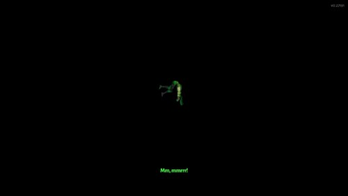
**What.** 도달 기록이 있는 실패 화면. **Why.** 실패도 도달점 / 다음 목표로 마무리. → 적용: FailedWake 분기(2) + 다음 목표.

> 글로: **결과는 빌드 vs 통계를 분할해야 함**(Brotato). Dream Break = 승리감, Dawn Wake = 안도, Failed = 차분 — 같은 화면, 다른 감정.

#### Wireframe
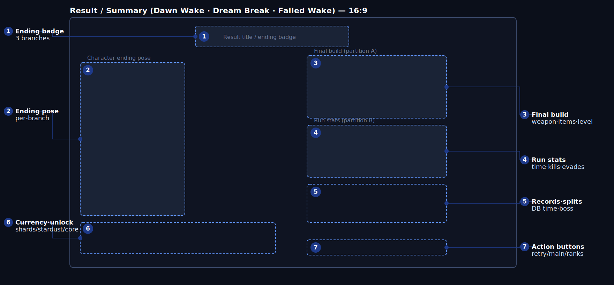

#### Legend
| # | code | 요소 | 위치 | 표시 | 동작/상태 (분기별) | 데이터 바인딩 | 기준 | UX 의도 | a11y |
| --- | --- | --- | --- | --- | --- | --- | --- | --- | --- |
| 1 | D1 | 종료 배지 | 상단 중앙 | 항상 | DawnWake/DreamBreak/FailedWake — 텍스트+색+아이콘 | 분기(§4-1), `AlarmReached`·`DreamBreakAchieved`(§12-1) | 진입 시 분기 배지 | 어떻게 끝났나 | 텍스트 라벨 필수 |
| 2 | D2 | 종료 포즈 | 좌측 | 항상 | 분기별 포즈+대사(§9-4) | `Character.id`(§12-2), 대사(§9-4) | 분기 포즈/대사 동기화 | 캐릭터 클로즈업 | 자막+음성, 컷인 토글 |
| 3 | D3 | 최종 빌드 (A) | 우상단 | 항상 | 무기 레벨 + 아이템(≤6) + 레벨 | `CombatWeapon`·`Item`·`weapon_level`·`level_reached`(§12-2) | 종료 시 정확 | 이번 런의 빌드 | 아이콘+이름+레벨 |
| 4 | D4 | 런 통계 (B) | 우측 중단 | 항상 | 시간·처치·정화·루시드 회피·보스 시간 | `RunTelemetry.*`(§12-2) | 텔레메트리 정확 | 성능 숫자 | 줄 맞춤+숫자 |
| 5 | D5 | 기록·구간 | 우측 하단 | 분기별 | DB Time·보스 구간·히든 해금·무피해·최고 정화(§10) | `dream_break_stage_times`(§12-2), 기록(§10) | 달성 시만, 아니면 "—" | 경쟁/PB | 텍스트+숫자+PB 배지 |
| 6 | D6 | 화폐·해금 | 좌측 하단 | 항상 | dream shards/stardust/lucid core + 해금(§2-3) | 메타 화폐(§2-3) | 종료 시 즉시 표시 | 반복 동기 | 아이콘+숫자+해금 텍스트 |
| 7 | D7 | 액션 버튼 | 우측 하단 | 항상 | Retry/Main/Leaderboard | 라우팅 | ≤100ms, 기본 포커스 | 다음 행동 | 버튼+프롬프트 |

#### 분기별 차이
| 분기 | D1 배지/색 | D2 대사 (§9-4) | D5 강조 | 특이 |
| --- | --- | --- | --- | --- |
| `DawnWake` | 새벽 색, "Dawn Wake" | "…꿈이었구나. *휴.*" | 생존·정화 | 7:00 + 보스 처치 = 보스 보상 없음(§4-1) |
| `DreamBreak` | 화이트아웃, "Dream Break" | "어? 진짜 쐈다고 생각했는데…" | DB Time·구간·무피해 | 트루 엔딩 강조, lucid core |
| `FailedWake` | 차가운 색, "Failed Wake" | 식은땀 | 도달점·다음 목표 | 실패 동기(§13-3 #8) |

#### State matrix (D7 / D5)
| 요소 | default | hover/focus | selected | disabled | loading | empty | error |
| --- | --- | --- | --- | --- | --- | --- | --- |
| 액션 버튼 (D7) | 일반 | 강조+링 | 기본 포커스(Retry) | 리더보드 오프라인 = 흐림+"Offline" | 진입 페이드 | N/A: 버튼 3개 | "전환 실패 — 재시도" |
| 기록 (D5) | 값 | 항목 상세 | 신기록 = 배지 | 미달성 = "—"(분기 해당 없음) | "계산 중" | "기록 없음" | "기록 로드 오류" |
| 화폐 (D6) | 표시 | — | 신규 해금 = 강조 | — | 정산 애니메이션 | "없음" | "정산 오류" |

#### Input parity
| action | mouse | key | pad | screen reader |
| --- | --- | --- | --- | --- |
| 버튼 포커스 | hover | Tab/방향키 | D-Pad | "Retry (기본)" |
| 실행 | 클릭 | Enter | A/○ | "Retry 실행" |
| 기록 상세 | hover | 방향키 | RB | "Dream Break Time 9:12, 신기록" |
| 메인 | 클릭 | Esc | B | "메인 메뉴" |

#### Data binding
| code | field (GDD §) | event | UI-proposed (추가 필요) | format | fallback |
| --- | --- | --- | --- | --- | --- |
| D1 | 분기(§4-1) | `AlarmReached`·`DreamBreakAchieved`(§12-1) | `RunEnded{result}` | badge | "result TBD" |
| D2 | `Character.id`(§12-2), 대사(§9-4) | (위와 동일) | — | pose+subtitle | 기본 |
| D3 | `CombatWeapon`·`Item`·`weapon_level`·`level_reached`(§12-2) | — | `RunBuildSnapshot` | icon+Lv | "없음" |
| D4 | `RunTelemetry.*`(§12-2) | — | `RunStatsSnapshot` | numbers | 0 |
| D5 | `dream_break_stage_times`(§12-2), 기록(§10) | `DreamBreakAchieved`(§12-1) | `RecordSplits` | time/number | "—" |
| D6 | 메타 화폐(§2-3) | — | `RewardsGranted`, `UnlocksGranted` | number+unlock | 0 |

> 추가 필요: `RunEnded{result}/RunBuildSnapshot/RunStatsSnapshot/RecordSplits/RewardsGranted/UnlocksGranted`.

#### Navigation
Retry→O2 / Main / Leaderboard(O6, 매칭 필터). 기본 포커스 **Retry**. 패드 B/Esc = Main.

#### Edge cases
동시 종료(§4-1): 7:00 + 처치 → DawnWake 우선. Dream Break 컷씬 진입 후 7:00 → DreamBreak 유지. 오프라인: 리더보드 버튼 흐림+사유, 기록 캐시. 신기록: D5 배지+사운드. FailedWake: 그래도 일부 보상 지급(§2-3) + 다음 목표.

#### Accessibility
종료 분기는 텍스트 라벨 + 아이콘으로, 색만으로 X(§9-3). 컷인/엔딩 토글. 자막 크기/배경. 미달성 기록은 "—"(공백 없음). 기본 포커스/순서 명확.

#### UX rationale
- **한눈에 읽히게**: 상단 큰 배지가 "어떻게 끝났나"를 감정과 함께 전하고, 아래에 이번 런의 빌드(무기/아이템)와 플레이 기록(시간/처치/회피)을 좌/우로 분할해 끼이지 않게.
- **조작·실수 방지**: 버튼 3개, 기본 포커스 Retry로 원탭 리플레이; 리더보드 불가 = 흐림+사유.
- **재미·손맛**: Dream Break = 승리의 화이트아웃 + 트루 엔딩 대사; Dawn Wake = 안도; 실패 = 차분 — 분기별 감정. 신기록 = 배지.
- **첫 플레이 vs 반복**: 실패는 도달점 + 다음 목표를 보여 다시 하고 싶게; 베테랑은 DB Time/구간/무피해 추격.
- **접근성**: 분기를 텍스트로 명시; 연출 토글 가능.
- **특히 조심할 점**: ① 빌드/통계 흐려짐 → 분할(Brotato); ② 실패가 막다른 길처럼 느껴짐 → 도달/다음 목표/부분 보상(§13-3 #8); ③ 색약 분기 → 배지 텍스트; ④ 동시 종료 혼동 → §4-1 우선순위.

#### Open questions
FailedWake 메타 보상 비율. 리더보드 축 노출.

#### Acceptance
- [ ] 각 분기가 올바른 배지/포즈/대사 표시.
- [ ] 최종 빌드와 런 통계를 별도 영역에 표시.
- [ ] Dream Break는 DB Time·구간·무피해 기록 표시.
- [ ] 색약 모드에서 종료 분기를 텍스트/아이콘으로 구분.
- [ ] 기본 포커스 Retry; 패드만으로 재시작 가능.

---

## 6. 횡단 규칙

- **내비게이션 모델**
  - 아웃게임(O1–O6): 포커스 중심. 항상 기본 포커스 설정(Main=Single, Character=Kohaku, Stage=LD-001/Normal, Result=Retry, Pause=Resume). 뒤로/취소 = Esc/B. 되돌릴 수 없는 동작(종료/메인으로/해금/런 시작 손실)은 확인.
  - 인게임(I1–I2): 실시간. 모달(레벨업 I3) / 보호(보상 I4) / 일시정지(I5)만 오버레이; 그동안 전투 정지.
  - 입력 기기 전환 시 모든 C-PROMPT 글리프를 즉시 교체(암기 불필요).
- **글로벌 빈/로딩/오류**: `loading`은 **진입 애니메이션**과 **데이터 없음**을 구분("로딩…/동기화 중…" vs 페이드인). `error`는 **문제 + 해결**을 명시("기록 로드 오류 — 재시도"); 값 누락 = 마지막 값 + 경고 테두리. `empty`는 절대 공백이 아니라 사유를 제시("—", "미발견").
- **접근성 (GDD §9-3)**: 색약 팔레트(적/아군 탄, 위험 지대를 형태+색으로), 흔들림/플래시/후처리 강도, 히트 판정 표시, 궁극기 컷인 간소화, 오토에임 보정, 루시드 회피 보조, 자막(크기/배경/속도). **어떤 화면도 색만으로 상태를 전달하지 않는다.** 설정(O4)이 모든 것의 관문.
- **BM 일관성 (GDD §10)**: 유료 강화 없음 / 가챠 없음 → **어떤 화면에도 현금 구매 UI 없음.** 메타(O5)는 플레이로 번 화폐로만 해금.
- **레이아웃 / 안전 영역**: 16:9 (1920×1080). HUD는 가장자리/상단/하단, 중앙 비움. 좌상단(상태) / 하단(자원) / 상단 중앙(보스) 슬롯은 화면 간 고정 의미(P4). 21:9·4:3은 안전 영역 내 스케일(추후).

### 6-1. UX 종합 (GDD §13-3 리스크 연계)
| UX 리스크 (GDD §13-3) | 화면 | 결정 / 완화 | 검증 |
| --- | --- | --- | --- |
| 물량 속 위험 못 봄 (#5) | I1, I2 | HUD 가장자리, 중앙 비움; 위험 색+형태+사운드 | 적 180마리 + 색약 플레이테스트 |
| 시간 인지 vs 좌상단 다이제틱 타이머 | I1, I2 | 알람 좌상단 고정 + 마지막 60s 가장자리/사운드 + 히든 보스 시간 이중 | 임의 스크린샷에서 1s 가독 |
| 후반 지루함 (#3) | O3, I1, I6, O5 | 정화/봉인이 조기 보스 등장 시각화; 스테이지/결과에 Dream Break 목표; 메타 장기 목표 | 진행 인지 · 재시도율 |
| 루시드 회피가 너무 어렵/남발 (#4) | I1, I2 | 콤보 + 니어/루시드 보상 단계; 카운터 윈도우 가시화 | 초심자 우연 · 베테랑 의도 |
| Dream Break가 너무 어려움 (#8) | I2, I6 | 봉인 진행 · 히든 보스 접근; 실패 → 다음 목표 | 도달율 · 재시도율 |
| survivor-like 클론 외관 (#2) | 전체 | 루시드 회피 · 알람시계 · Dream Break · 캐릭터별 트리를 전면에 | 차별화 설문 |
| 스코프 크립 (#7) | O2, O3 | VS Kohaku/Toko/LD-001 활성, 나머지 잠금 | 범위 밖 미구현 점검 |
| 수익화 혼동 (BM §10) | O5, 전체 | 현금 UI 없음, 화폐 해금만 | 구매 화면 없음 |
| 라이선스/공식 혼동 (#1) | O1, O2 | 캐릭터 이름/표기 라이선스 영역 — **레이아웃만, 법무 별도** | 표기 가이드라인 검토 |
| 코옵 시간 정지가 타인 방해 (#6) | (범위 밖) | VS 미구현; 코옵 빌드에서 플레이어별/팀/합동 효과 분리 | — (UX 범위 밖) |

> #1과 #6은 일부 UX 밖(법무 / 코옵 빌드)이며 그렇게 표시됨. 나머지는 이 디자인 문서의 레이아웃/상태/피드백 규칙으로 처리.

## 7. Open questions (종합)
| # | 화면 | 질문 |
| --- | --- | --- |
| Q1 | I1 | 저체력 경고 임계치(% — 현재 25%) |
| Q2 | I1 | XP 바를 §9-2 HUD 요소로 승격? |
| Q3 | I1 | 정화(A7) vs 봉인(A3) 의미 중복 |
| Q4 | I2 | 보스 HP 페이즈 세그먼트 수 / 카운터 윈도우 배치 |
| Q5 | I3 | 빈 풀 폴백 보상 / 카드 i-frame 길이 |
| Q6 | I4 | 8s 보호 종료 시 미사용 SP/아이템 |
| Q7 | I6 | FailedWake 메타 보상 비율 / 리더보드 축 노출 |
| Q8 | O2/O3 | 해금 조건 텍스트 / 스탯 레이더 vs 바 / 난이도 잠금 |
| Q9 | O4 | 접근성 프리셋 / 실시간 적용 옵션 범위 |
| Q10 | O5 | 도감 스포일러 정책 / 영구 트리 vs 런 트리 시각 분리 |
| Q11 | O6 | 코옵 기록 노출 / 부정행위 정책 / 시즌 리셋 |
| Q12 | global | 21:9·4:3 안전 영역 · HUD 스케일 |
| Q13 | global | **데이터 계약**: §5 "UI-proposed" 이벤트 / 런타임 상태를 GDD §12-1/§12-2에 추가 |

> 필요한 런타임 필드/이벤트 전체 목록은 결정 추적기(`lucid_dawn_ui_ux_decisions.md` §4)에. 현금 결제 이벤트 없음(§10).

## 8. 버전 이력
| version | date | change |
| --- | --- | --- |
| v1.0 (EN master) | 2026-06-30 | 전체 아웃게임(O1–O6)+인게임(I1–I6) 주석형 와이어프레임 디자인 문서, 웹 수집 참고(interfaceingame, 8개 게임), 디자인 토큰 + 결정 추적기, 엔진 바인딩(부록 D), 사용성 테스트 계획(부록 E). 13개 와이어프레임 린트+렌더 통과. 한국어/중국어 버전은 이 마스터에서 파생. |

## 부록 A. 방법론 (근거)
UX rationale 섹션은 아래 프레임워크로 추론하되 본문에서는 이름을 절대 언급하지 않는다(쉬운 말 규칙).
| 프레임워크 | 사용처 |
| --- | --- |
| Celia Hodent, *The Gamer's Brain* | 모든 UX rationale의 척추(피드백/명료성/형태는 기능을 따른다/일관성/실수 방지 + 동기/감정/플로우) |
| Nielsen의 10가지 휴리스틱 | 상태 가시성, 일관성, 오류 메시지(문제+해결), 회상보다 인식 |
| Pinelle 게임 사용성 휴리스틱 (CHI 2008) | 카메라/조작/숨은 상태/마이크로매니지먼트 실패 모드 |
| Desurvire PLAY / HEP | 재미/몰입 렌즈 |
| Fagerholt & Lorentzon, *Beyond the HUD* | HUD 요소 분류(다이제틱 알람시계 vs 메타/비다이제틱 바) |
| Swink *Game Feel*; Jonasson & Purho "Juice it or Lose it" | 손맛 스택 + 연출 예산 + 혼돈 속 가독성 |
| Xbox XAG; IGDA GASIG Top Ten; Game Accessibility Guidelines | 색 독립성, 자막, 흔들림/플래시 토글, 리매핑, 난이도/속도 |

## 부록 B. 참고 인덱스 / 수집 레시피
- **Game UI Reference CLI (`ui-ref`)** 로 **interfaceingame.com** 게임별 페이지에서 수집: Hades · Risk of Rain 2 · Honkai: Star Rail · Slay the Spire · Returnal · Hollow Knight · Moonlighter · Destiny 2. 화면 유형별로 `references/ui/web-refs/<category>/` 에 큐레이션. 재배포 가능한 에셋 팩이 아니라 개인 리서치용 인용. 매니페스트: `ui_research/manifests/local_ui_refs_manifest.md`.

```bash
# one-time: pip install playwright && playwright install chromium
# put interfaceingame per-game URLs in ui_research/urls.txt, then
ui-ref collect --browser --site interfaceingame --scroll 8 --download-gallery-assets --download-asset-limit 10
# gap-fill specific screens:
ui-ref collect --browser --site interfaceingame --download-title-contains defeat --download-title-contains paused --download-title-contains audio
ui-ref scan-local
```
> Game UI Database는 SPA + Cloudflare → 헤드리스 수집 차단(`scrn=` 필터와 `gameData.php?id=` 게임별 모두 타임아웃). interfaceingame 게임별을 사용; 직접적인 survivor-like는 §B-2에서 글로 설명.

### B-2. 직접적인 survivor-like 패턴 (글 — 미캡처)
수집한 게임들은 인접 로그라이트이므로, 직접적인 **bullet-heaven / survivor-like** 관습을 여기 기록한다. (추후 GUIDB Soulstone Survivors = `gameData.php?id=2403` 등에서 캡처, 위 헤드리스 제한 적용.)
| 화면 | 직접 타이틀 | 채택/대비 패턴 | 우리의 콜아웃 |
| --- | --- | --- | --- |
| HUD | Vampire Survivors | **타이머 상단 중앙**, **XP = 상단 전폭 띠**, HP는 플레이어 근처, 어빌리티 아이콘 한 코너, 최소 크롬 | I1: XP A1 채택; 알람 좌상단(의도적 예외) |
| HUD | 20 Minutes Till Dawn | **수동 조준**(오토타깃 아님) → 조준 피드백/조준점, 능동 어빌리티 | I1: 오토에임 보정 옵션(§9-3) + 스킬 슬롯 A8 |
| 레벨업 | Vampire Survivors / Brotato | **일시정지 + 3–4장 카드**, 희귀도 색, 즉시 가독, 확정 시 짧은 i-frame | I3: 일시정지 카드 B4, 희귀도 B5 |
| 레벨업 | 20 Minutes Till Dawn | **고르면서 현재 빌드/시너지 검토**(모더가 채우는 빈틈) | I3: 현재 빌드 패널 B3 |
| 결과 | Brotato | **빌드 vs 통계 분할**, 메타 화폐/해금 노출 | I6: D3 빌드 / D4 통계 분할 |
| 인벤토리/빌드 | Soulstone Survivors / Halls of Torment | 쌓인 아이템 다수 **축소 + 스택 수**, 희귀도 색, 일시정지 시 전체 빌드 패널 | I3 B3, I6 D3 |
| 보스 | LoL Swarm (서바이버 모드) | 상단 수평 보스 바가 **타이머 슬롯 점유**, 페이즈 세그먼트 | I2: 보스 HP A10 (우리는 빈 상단 중앙 슬롯 점유) |

> 의도적 차별화(클론 외관 회피, §13-3 #2): 루시드 회피(카운터 윈도우 A12) · 알람시계(다이제틱 좌상단) · Dream Break(히든 보스 + 시간 이중 A13) · 캐릭터별 스킬 트리(I4). 직접 타이틀들이 하지 않는 것을 전면에 내세운다.

## 부록 C. 빌드 (공유본) + 와이어프레임 검증
```bash
pip install markdown python-docx
python <skill>/templates/build_pdf.py  lucid_dawn_ui_ux_design.en.md --css <skill>/templates/design-pdf.css
python <skill>/templates/build_docx.py lucid_dawn_ui_ux_design.en.md   # render wireframes/*.png first
```
13개 와이어프레임 모두 `validate_wireframe.py`(XML, 배경 rect, 콜아웃 ≤10, 배지 2회, 리더선 ≤4pt 비교차, 거터 ≤6/측면, 캔버스 밖 없음) + 헤드리스-Chrome 렌더 눈검사 통과. flow.svg는 와이어플로우(콜아웃 린터 면제).

## 부록 D. 구현 바인딩 — Unity 6 UI Toolkit × DOTS/ECS
> §5 데이터 바인딩을 선택 스택(Unity 6 · DOTS · UI Toolkit)에서 **이벤트 기반, no-GC**로 구현. 권위 참조: `unity-dots-manual`, bullet-hell 렌더링 레시피. 최종 결정 = TDD.

- **역할**: ECS(시뮬, jobs/Burst)가 런타임 상태(`RunState`, `PlayerRuntime`, 보스/시련 런타임 — §7 추가)의 단일 진실 원천. UI Toolkit(매니지드, 메인 스레드)이 렌더. **브리지 `SystemBase`**(메인 스레드)가 ECS를 읽어 **변경 시에만** UI로 푸시 — "이벤트 기반"의 실제 구현.
- **No-GC / 매 프레임 리빌드 없음**(HUD가 적 180마리에서 비용 들면 안 됨, P3): 상태는 `IComponentData` 싱글톤; 브리지가 ECS **ChangeVersion**을 확인해 변경된 라벨만 갱신; `VisualElement` 참조 캐시(매 프레임 `Q<>()` 금지); 루프 내 LINQ/박싱 금지; 타이머 텍스트는 매 프레임이 아니라 **초당** 갱신.
- **월드 vs 스크린 공간**: 고정 HUD = 스크린 오버레이(UIDocument/PanelSettings); 플레이어/적 앵커(루시드 콤보 A6, 카운터 윈도우 A12, **데미지 숫자**) = 월드 앵커 — **무거운 월드 텍스트(데미지 숫자)는 UI Toolkit이 아니라 프로젝트의 대량 렌더 경로를 통과**; UI Toolkit은 HUD 앵커된 소수만.
- **이벤트 ↔ ECS**: §5 "UI-proposed" 이벤트는 브리지 변경 감지로 구현(DOTS 친화); GDD §12-1 이벤트(`BossDefeated` 등)는 ECS 이벤트/싱글톤 플래그로 받아 UI 전이 구동. 모달/보상 = 시뮬 일시정지 동기(시스템-그룹 정지).
- **멀티 해상도 / 입력 / 현지화**: PanelSettings 스케일 모드 + 안전 영역(추적기 D-18); UI Toolkit 포커스 내비게이션(링 ≥3:1) + Input System으로 게임패드; Unity Localization 문자열 테이블(KR/EN/CN 길이, 자막 ~≤38/줄, 로케일 숫자 형식).
- **체크리스트**: [ ] 고밀도에서 0 alloc / 최소 리플로우 · [ ] 변경 시에만 갱신(프로파일링) · [ ] 대량 월드 텍스트는 UI 프레임워크 밖 · [ ] 모달 중 시뮬 일시정지 동기 · [ ] 모든 화면에서 패드 포커스 내비.

## 부록 E. 사용성 테스트 계획 (핵심 루프)
> UX rationale은 휴리스틱 추론이며, 이것이 그 검증 방법이다. 와이어프레임만의 주장(혼돈 속 가독성)은 엔진 빌드에서 반드시 재검증해야 한다.

- **목표/가설**: 핵심 루프(메뉴→전투→레벨업→보스→보상→결과)를 헤매지 않고 통과; 핵심 가독성: ① 7:00까지 시간 ≤1s 가독, ② 적 180마리에서 위험/플레이어/픽업 식별, ③ 카드 ≤1s 가독, ④ 보상 순서(SP→트리→4종 선택) 이해.
- **방법/참가자**: 진행자 동반 think-aloud, 6–8명 — survivor-like 초심자 3 + 베테랑 3 + 색약 1–2(별도 세션). 빌드: VS 범위.
- **태스크 시나리오 ↔ 수용 기준**:
  | # | 태스크 | 성공 | 링크 |
  | --- | --- | --- | --- |
  | T1 | 시작부터 런 개시까지 | ≤3분, 가이드 없이, 캐릭터+스테이지 선택→시작 | O1/O2/O3 |
  | T2 | (임의 일시정지) "7:00까지 얼마?" | ≤1s 정답 | I1 A2 (§3-2) |
  | T3 | 레벨업 카드 1장 선택 | ≤1s 가독, **빌드 패널 사용 관찰** | I3 B3/B4 |
  | T4 | 루시드 회피 시도 | 초심자 우연 + 콤보 확인 / 베테랑 의도적 | I1 A6 (§3-2) |
  | T5 | 보스전 | 보스 바 확인, 크랙→그로기 & 카운터 **사용** | I2 A10/A11/A12 |
  | T6 | 보스 보상 | **SP→트리→4종 선택 순서 이해**, 노드/아이템 구분 | I4 |
  | T7 | 결과 | 분기 인식, 빌드 vs 통계 분할, Retry로 재시작 | I6 |
- **지표**: 태스크별 성공/시간/오류 · SUS · 재미/몰입 설문 · **혼돈 속 가독성**(정지된 고밀도 스크린샷 식별 정확도, 별도 색약 세션) · 접근성(색약 식별 / 토글 동작).
- **통과 기준 / 반복**: 핵심 태스크(T1·T2·T3·T6) 성공 ≥85%, T2 1s-가독 ≥90%, 색약 치명 식별 =100%. 미달 → 추적기의 해당 수치 조정 후 재테스트; §8에 반영.
- **한계**: 이것은 *테스트 설계*다. 실제 클릭 가능한 프로토타입 / 세션 / SUS 집계는 빌드 + 인원이 필요 — 여기서 수행하지 않음.
